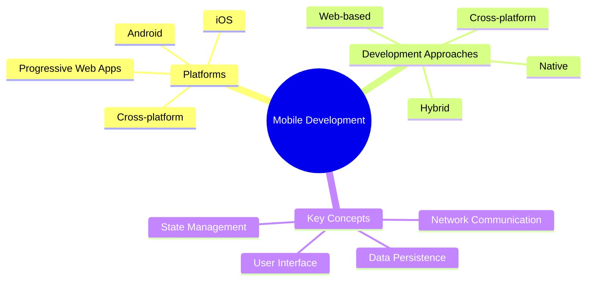

# Introduction to Mobile Development

[Back to Course Content](README.md) | [Next: Mobile UI/UX Design →](ui-ux-design.md)

> Reference: This content is based on 1.pdf and 2.pdf

## What is Mobile Development?

Mobile development is the process of creating software applications that run on mobile devices. It involves designing, developing, testing, and deploying applications for various mobile platforms, considering the unique constraints and capabilities of mobile environments.



## Historical Evolution of Mobile Development

The field of mobile application development has evolved significantly over the past decades:

| Era | Time Period | Key Characteristics | Notable Platforms |
|-----|-------------|---------------------|-------------------|
| Early Mobile | 1990s - 2006 | Simple applications, limited capabilities, proprietary platforms | Nokia Symbian, BlackBerry OS, Palm OS |
| Smartphone Revolution | 2007 - 2010 | Touch interfaces, app stores, improved connectivity | iOS, Android, Windows Mobile |
| Modern Mobile | 2011 - Present | Advanced capabilities, cross-platform frameworks, cloud integration | iOS, Android, PWAs, cross-platform frameworks |

The evolution from early mobile devices with limited capabilities to today's sophisticated smartphones has fundamentally changed development approaches, user expectations, and technical possibilities.

## Mobile Platforms Overview

### 1. Android Development

The Android platform, developed by Google, is based on the Linux kernel and uses Java/Kotlin for application development.

#### Key Android Concepts:

- **Activities**: Single, focused operations users can perform
- **Fragments**: Modular sections of an activity's UI
- **Intents**: Messaging objects for requesting actions
- **Services**: Long-running operations in the background
- **Content Providers**: Managing shared application data
- **Broadcast Receivers**: Components responding to system-wide events

```java
// Example: Basic Android Activity
public class MainActivity extends AppCompatActivity {
    @Override
    protected void onCreate(Bundle savedInstanceState) {
        super.onCreate(savedInstanceState);
        setContentView(R.layout.activity_main);
        
        // Initialize UI components
        Button button = findViewById(R.id.button);
        button.setOnClickListener(new View.OnClickListener() {
            @Override
            public void onClick(View v) {
                // Handle button click
            }
        });
    }
}
```

### 2. iOS Development

The iOS platform, developed by Apple, uses Swift/Objective-C for application development and follows the Cocoa Touch framework principles.

#### Key iOS Concepts:

- **View Controllers**: Managing views and mediating between views and data
- **Delegates**: Protocol-based communication between objects
- **Blocks/Closures**: Self-contained units of functionality
- **Notification Center**: Broadcasting information across the app
- **Core Data**: Object graph and persistence framework
- **UIKit/SwiftUI**: Framework for handling UI components and interactions

```swift
// Example: Basic iOS View Controller
class ViewController: UIViewController {
    override func viewDidLoad() {
        super.viewDidLoad()
        
        // Initialize UI components
        let button = UIButton(frame: CGRect(x: 0, y: 0, width: 200, height: 50))
        button.setTitle("Click Me", for: .normal)
        button.addTarget(self, action: #selector(buttonTapped), for: .touchUpInside)
        view.addSubview(button)
    }
    
    @objc func buttonTapped() {
        // Handle button tap
    }
}
```

### 3. Cross-platform Development

Cross-platform frameworks allow developers to write code once and deploy to multiple platforms, reducing development time and maintenance costs.

#### Key Cross-platform Frameworks:

- **Flutter**: Google's UI toolkit using Dart language
- **React Native**: Facebook's JavaScript framework
- **Xamarin**: Microsoft's C# based framework
- **Ionic**: Web technologies-based framework
- **Kotlin Multiplatform**: Kotlin-based shared code approach

#### Theoretical Advantages and Disadvantages

| Aspect | Native Development | Cross-platform Development |
|--------|-------------------|---------------------------|
| Performance | High (direct access to platform APIs) | Moderate (abstraction layer overhead) |
| UI/UX Fidelity | High (platform-specific components) | Good (depending on framework) |
| Access to Features | Full access to all platform capabilities | Varies by framework, may require plugins |
| Code Reuse | Low (separate codebases) | High (significant shared code) |
| Development Cost | Higher (multiple teams/skills) | Lower (single codebase) |
| Maintenance | Complex (multiple codebases) | Simpler (shared codebase) |

```dart
// Example: Flutter Widget
class MyHomePage extends StatelessWidget {
  @override
  Widget build(BuildContext context) {
    return Scaffold(
      appBar: AppBar(
        title: Text('My App'),
      ),
      body: Center(
        child: ElevatedButton(
          onPressed: () {
            // Handle button press
          },
          child: Text('Click Me'),
        ),
      ),
    );
  }
}
```

## Development Environments

### 1. Android Studio

Android Studio is the official Integrated Development Environment (IDE) for Android development, built on IntelliJ IDEA.

#### Key Features:
- Gradle-based build system
- Code editor with advanced features
- Visual layout editor
- APK analyzer
- Performance profilers
- Emulator integration

```xml
<!-- Example: Android Layout -->
<?xml version="1.0" encoding="utf-8"?>
<LinearLayout xmlns:android="http://schemas.android.com/apk/res/android"
    android:layout_width="match_parent"
    android:layout_height="match_parent"
    android:orientation="vertical">

    <Button
        android:id="@+id/button"
        android:layout_width="wrap_content"
        android:layout_height="wrap_content"
        android:text="Click Me" />

</LinearLayout>
```

### 2. Xcode

Xcode is Apple's IDE for developing iOS, macOS, watchOS, and tvOS applications.

#### Key Features:
- Interface Builder for visual UI design
- Swift/Objective-C support
- Simulator for testing
- Instruments for profiling
- TestFlight integration
- App Store submission tools

```swift
// Example: iOS Storyboard Configuration
class SceneDelegate: UIResponder, UIWindowSceneDelegate {
    var window: UIWindow?

    func scene(_ scene: UIScene, willConnectTo session: UISceneSession, options connectionOptions: UIScene.ConnectionOptions) {
        guard let windowScene = (scene as? UIWindowScene) else { return }
        
        window = UIWindow(windowScene: windowScene)
        window?.rootViewController = ViewController()
        window?.makeKeyAndVisible()
    }
}
```

### 3. VS Code with Flutter

Visual Studio Code with Flutter extensions provides a lightweight yet powerful environment for cross-platform development.

#### Key Features:
- Cross-platform IDE
- Extensive plugin ecosystem
- Integrated debugging
- Hot reload support
- Widget inspector
- Performance analysis

```yaml
# Example: Flutter Configuration
flutter:
  uses-material-design: true
  
  assets:
    - assets/images/
    - assets/fonts/
    
  dependencies:
    flutter:
      sdk: flutter
    http: ^0.13.0
    provider: ^6.0.0
```

## Mobile Development Fundamentals

### 1. Application Lifecycle

Understanding the application lifecycle is crucial for proper resource management, UI updates, and handling system events.

#### Key Lifecycle States:

1. **Initialization**: Application loading and initial setup
2. **Active/Running**: Application is visible and interactive
3. **Background**: Application is not visible but still loaded in memory
4. **Suspended**: Application is in memory but not executing code
5. **Terminated**: Application is removed from memory

```java
// Example: Android Activity Lifecycle
public class MainActivity extends AppCompatActivity {
    @Override
    protected void onCreate(Bundle savedInstanceState) {
        super.onCreate(savedInstanceState);
        // Initialize
    }
    
    @Override
    protected void onStart() {
        super.onStart();
        // App becomes visible
    }
    
    @Override
    protected void onResume() {
        super.onResume();
        // App is in foreground
    }
    
    @Override
    protected void onPause() {
        super.onPause();
        // App is partially visible
    }
    
    @Override
    protected void onStop() {
        super.onStop();
        // App is not visible
    }
    
    @Override
    protected void onDestroy() {
        super.onDestroy();
        // App is being destroyed
    }
}
```

### 2. User Interface Components

Mobile interfaces are composed of standardized UI components that follow platform-specific design guidelines.

#### Common UI Component Types:

- **Containers**: Structural elements that hold other components
- **Input Controls**: Elements for user data entry (text fields, checkboxes)
- **Informational Elements**: Components displaying information to users
- **Navigation Components**: Elements for moving between screens
- **Dialogs & Popups**: Overlay elements for temporary information or actions

```dart
// Example: Flutter UI Components
class MyApp extends StatelessWidget {
  @override
  Widget build(BuildContext context) {
    return MaterialApp(
      home: Scaffold(
        appBar: AppBar(
          title: Text('My App'),
          actions: [
            IconButton(
              icon: Icon(Icons.settings),
              onPressed: () {
                // Handle settings
              },
            ),
          ],
        ),
        body: ListView(
          children: [
            Card(
              child: ListTile(
                leading: Icon(Icons.star),
                title: Text('Item 1'),
                subtitle: Text('Description'),
                trailing: Icon(Icons.arrow_forward_ios),
                onTap: () {
                  // Handle tap
                },
              ),
            ),
          ],
        ),
        floatingActionButton: FloatingActionButton(
          onPressed: () {
            // Handle FAB press
          },
          child: Icon(Icons.add),
        ),
      ),
    );
  }
}
```

### 3. Mobile-Specific Constraints and Capabilities

Mobile development requires considering specific constraints and leveraging unique capabilities.

#### Constraints:

- **Limited Processing Power**: Mobile CPUs have lower performance than desktops
- **Memory Restrictions**: Less RAM and storage space available
- **Battery Dependencies**: Applications must optimize for energy efficiency
- **Network Variability**: Connections may be unreliable or have varying speeds
- **Screen Size Variations**: Multiple device sizes and resolutions

#### Capabilities:

- **Sensors**: Accelerometer, gyroscope, location, proximity, etc.
- **Camera/Microphone**: Media capture capabilities
- **Connectivity**: Multiple radio technologies (Cellular, WiFi, Bluetooth)
- **Touch Interface**: Multi-touch, gestures, haptic feedback
- **Notifications**: System-level alerting mechanisms

## Tools and Frameworks

### 1. Version Control

Version control systems are essential for team collaboration and code management in mobile development.

```bash
# Example: Git Commands
git init
git add .
git commit -m "Initial commit"
git remote add origin <repository-url>
git push -u origin main
```

### 2. Package Management

Package managers facilitate the integration of third-party libraries and dependencies into mobile applications.

```yaml
# Example: Flutter Dependencies
dependencies:
  flutter:
    sdk: flutter
  cupertino_icons: ^1.0.2
  http: ^0.13.0
  provider: ^6.0.0
  shared_preferences: ^2.0.0
```

### 3. Testing Tools

Comprehensive testing ensures application quality across various devices and scenarios.

```dart
// Example: Flutter Test
void main() {
  test('Counter increments smoke test', () {
    expect(Counter().value, 0);
    Counter().increment();
    expect(Counter().value, 1);
  });
}
```

## Mobile Development Paradigms

### 1. Declarative UI

Modern mobile frameworks are moving toward declarative UI patterns, where developers describe what the UI should look like rather than how to create it.

#### Benefits:
- Reduced state management complexity
- More predictable rendering
- Easier testing and debugging
- Better performance optimization

### 2. Reactive Programming

Reactive programming focuses on data flows and the propagation of changes, which is particularly valuable for dynamic mobile interfaces.

#### Key Concepts:
- **Observables**: Data sources that can be observed for changes
- **Subscribers**: Components that react to changes in observables
- **Operators**: Functions for transforming data streams
- **Schedulers**: Controlling when and where computation occurs

### 3. Offline-First Design

Offline-first is an architectural approach that prioritizes functioning without a network connection.

#### Implementation Strategies:
- Local data persistence
- Optimistic UI updates
- Background synchronization
- Conflict resolution
- Progressive enhancement

## Best Practices

1. **Development**
   - Follow platform guidelines and patterns
   - Use appropriate architecture patterns (MVVM, Clean Architecture, etc.)
   - Implement proper error handling and graceful degradation
   - Write clean, maintainable code with clear separation of concerns
   - Optimize for battery and data usage

2. **Testing**
   - Write comprehensive unit tests for business logic
   - Perform UI testing with automation tools
   - Conduct integration testing across components
   - Test on multiple devices and OS versions
   - Implement analytics for real-world usage data

3. **Performance**
   - Optimize app size through code splitting and asset compression
   - Minimize network calls with caching and batching
   - Implement efficient state management
   - Handle memory efficiently with proper resource cleanup
   - Profile and optimize rendering performance

## Common Pitfalls

1. **Development Issues**
   - Platform-specific API inconsistencies
   - Version compatibility across different OS versions
   - Performance problems on low-end devices
   - Security vulnerabilities in data storage and transmission
   - Inadequate error handling and recovery mechanisms

2. **Testing Issues**
   - Device fragmentation leading to inconsistent behavior
   - OS version differences affecting functionality
   - Network condition variations impacting user experience
   - Battery consumption patterns varying by device
   - Input method differences (touch, keyboard, voice)

3. **Deployment Issues**
   - App store guidelines and review process delays
   - Version management across different distribution channels
   - Update distribution and adoption rates
   - User feedback handling and iteration cycles
   - Feature parity across platforms

## Mobile Development Glossary

- **API (Application Programming Interface)**: A set of routines, protocols, and tools for building software applications
- **APK (Android Package Kit)**: The file format used to distribute and install Android applications
- **IPA (iOS App Store Package)**: The file format used to distribute and install iOS applications
- **SDK (Software Development Kit)**: A collection of software tools and programs used by developers
- **IDE (Integrated Development Environment)**: Software application providing facilities for software development
- **ADB (Android Debug Bridge)**: Command-line tool for communicating with Android devices
- **Gradle**: Build automation system used primarily for Android development
- **CocoaPods**: Dependency manager for Swift and Objective-C Cocoa projects
- **Hot Reload**: Feature allowing code changes to be immediately reflected without restarting the app
- **Material Design**: Design language developed by Google for a unified experience across platforms
- **Human Interface Guidelines**: Apple's set of recommendations for designing iOS applications
- **PWA (Progressive Web App)**: Web application that functions like a mobile app
- **WebView**: Component that displays web content within a native app
- **Deep Linking**: Technique for launching a mobile app directly to specific content
- **Push Notification**: Message sent from a server to a mobile application
- **Responsive Design**: Design approach aimed at providing optimal viewing across different devices

## Exercises

1. Set up a development environment for both Android and iOS
2. Create a simple application with basic UI components on both platforms
3. Implement navigation between multiple screens
4. Develop a form that handles user input with validation
5. Implement state management for a simple counter application
6. Create a cross-platform version of your application using Flutter or React Native
7. Compare performance and user experience between native and cross-platform implementations

## Additional Resources

- [Android Developer Guide](https://developer.android.com/guide)
- [iOS Developer Guide](https://developer.apple.com/guide/)
- [Flutter Documentation](https://flutter.dev/docs)
- [React Native Documentation](https://reactnative.dev/docs/getting-started)
- [Mobile Development Patterns](https://www.mobiledevelopmentpatterns.com)
- [Material Design Guidelines](https://material.io/design)
- [Apple Human Interface Guidelines](https://developer.apple.com/design/human-interface-guidelines/) 