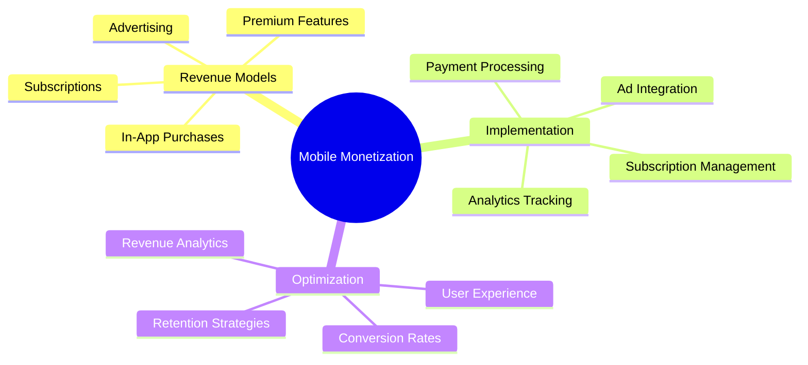

# Mobile App Monetization

[Back to Course Content](README.md) | [Previous: Analytics](analytics.md)

> Reference: This content is based on 11.pdf

## What is Mobile App Monetization?

Mobile app monetization is the process of generating revenue from mobile applications through various strategies such as in-app purchases, advertising, subscriptions, and premium features. It involves implementing effective revenue models while maintaining user satisfaction.



## Revenue Models

### 1. In-App Purchases

```kotlin
// Example: Android In-App Purchases
class PurchaseManager {
    private val billingClient = BillingClient.newBuilder(context)
        .setListener { billingResult, purchases ->
            handlePurchaseResult(billingResult, purchases)
        }
        .enablePendingPurchases()
        .build()
    
    fun initialize() {
        billingClient.startConnection(object : BillingClientStateListener {
            override fun onBillingSetupFinished(billingResult: BillingResult) {
                if (billingResult.responseCode == BillingClient.BillingResponseCode.OK) {
                    queryPurchases()
                }
            }
            
            override fun onBillingServiceDisconnected() {
                // Retry connection
            }
        })
    }
    
    fun purchaseItem(productId: String) {
        val productDetailsParams = QueryProductDetailsParams.newBuilder()
            .setProductList(
                listOf(
                    QueryProductDetailsParams.Product.newBuilder()
                        .setProductId(productId)
                        .setProductType(BillingClient.ProductType.INAPP)
                        .build()
                )
            )
            .build()
            
        billingClient.queryProductDetailsAsync(productDetailsParams) { billingResult, productDetailsList ->
            if (billingResult.responseCode == BillingClient.BillingResponseCode.OK) {
                launchBillingFlow(productDetailsList[0])
            }
        }
    }
}
```

### 2. Ad Integration

```swift
// Example: iOS Ad Integration
class AdManager {
    private let bannerView = GADBannerView(adSize: GADAdSizeBanner)
    private let interstitial = GADInterstitialAd()
    
    func setupBannerAd() {
        bannerView.adUnitID = "ca-app-pub-xxxxxxxxxxxxxxxx/yyyyyyyyyy"
        bannerView.rootViewController = self
        bannerView.load(GADRequest())
    }
    
    func setupInterstitialAd() {
        let request = GADRequest()
        GADInterstitialAd.load(
            withAdUnitID: "ca-app-pub-xxxxxxxxxxxxxxxx/yyyyyyyyyy",
            request: request
        ) { [weak self] ad, error in
            if let error = error {
                print("Failed to load interstitial ad: \(error)")
                return
            }
            self?.interstitial = ad
        }
    }
    
    func showInterstitialAd() {
        if let interstitial = interstitial {
            interstitial.present(fromRootViewController: self)
        }
    }
}
```

## Subscription Management

### 1. Subscription Implementation

```dart
// Example: Flutter Subscription Management
class SubscriptionManager {
  final _inAppPurchase = InAppPurchase.instance;
  final _subscriptions = <ProductDetails>[];
  
  Future<void> initialize() async {
    final bool available = await _inAppPurchase.isAvailable();
    if (!available) return;
    
    const Set<String> _kIds = <String>{
      'monthly_subscription',
      'yearly_subscription',
    };
    
    final ProductDetailsResponse productDetailsResponse =
        await _inAppPurchase.queryProductDetails(_kIds);
    
    if (productDetailsResponse.error != null) {
      print('Error: ${productDetailsResponse.error}');
      return;
    }
    
    _subscriptions.addAll(productDetailsResponse.productDetails);
  }
  
  Future<void> purchaseSubscription(ProductDetails product) async {
    final PurchaseParam purchaseParam = PurchaseParam(
      productDetails: product,
    );
    
    try {
      await _inAppPurchase.buyConsumable(
        purchaseParam: purchaseParam,
      );
    } catch (e) {
      print('Error: $e');
    }
  }
}
```

### 2. Subscription Analytics

```kotlin
// Example: Android Subscription Analytics
class SubscriptionAnalytics {
    fun trackSubscriptionEvent(event: String, params: Bundle) {
        val bundle = Bundle().apply {
            putString("event", event)
            putAll(params)
        }
        FirebaseAnalytics.getInstance(context)
            .logEvent("subscription_event", bundle)
    }
    
    fun trackSubscriptionPurchase(productId: String, price: Double) {
        val bundle = Bundle().apply {
            putString("product_id", productId)
            putDouble("price", price)
            putString("currency", "USD")
        }
        trackSubscriptionEvent("purchase", bundle)
    }
    
    fun trackSubscriptionRenewal(productId: String) {
        val bundle = Bundle().apply {
            putString("product_id", productId)
        }
        trackSubscriptionEvent("renewal", bundle)
    }
}
```

## Premium Features

### 1. Feature Access Control

```swift
// Example: iOS Premium Features
class PremiumFeatureManager {
    private let userDefaults = UserDefaults.standard
    private let subscriptionService = SubscriptionService.shared
    
    func isPremiumFeatureEnabled(_ feature: String) -> Bool {
        return subscriptionService.isSubscribed() ||
               userDefaults.bool(forKey: "premium_\(feature)")
    }
    
    func unlockPremiumFeature(_ feature: String) {
        userDefaults.set(true, forKey: "premium_\(feature)")
        NotificationCenter.default.post(
            name: .premiumFeatureUnlocked,
            object: nil,
            userInfo: ["feature": feature]
        )
    }
    
    func showPremiumFeaturePrompt(_ feature: String) {
        let alert = UIAlertController(
            title: "Premium Feature",
            message: "This feature is available for premium users only.",
            preferredStyle: .alert
        )
        
        alert.addAction(UIAlertAction(title: "Upgrade", style: .default) { _ in
            self.showSubscriptionOptions()
        })
        
        alert.addAction(UIAlertAction(title: "Cancel", style: .cancel))
        
        present(alert, animated: true)
    }
}
```

### 2. Premium Content Management

```dart
// Example: Flutter Premium Content
class PremiumContentManager {
  final _premiumContent = <String, dynamic>{};
  
  Future<void> loadPremiumContent() async {
    if (!await _isPremiumUser()) return;
    
    final content = await _fetchPremiumContent();
    _premiumContent.addAll(content);
  }
  
  Widget buildContent(String contentId) {
    if (_premiumContent.containsKey(contentId)) {
      return _buildPremiumContent(_premiumContent[contentId]);
    }
    
    return _buildUpgradePrompt();
  }
  
  Widget _buildUpgradePrompt() {
    return Column(
      children: [
        Text('This content is available for premium users'),
        ElevatedButton(
          onPressed: () => _showSubscriptionOptions(),
          child: Text('Upgrade Now'),
        ),
      ],
    );
  }
}
```

## Best Practices

1. **Revenue Strategy**
   - Choose appropriate models
   - Balance user experience
   - Implement fair pricing
   - Monitor performance

2. **Implementation**
   - Secure payment processing
   - Handle edge cases
   - Provide clear UI
   - Track conversions

3. **Optimization**
   - A/B test pricing
   - Analyze user behavior
   - Improve conversion rates
   - Enhance retention

## Common Monetization Issues

1. **Payment Issues**
   - Failed transactions
   - Refund handling
   - Subscription management
   - Payment verification

2. **User Experience**
   - Intrusive ads
   - Complex purchase flow
   - Poor value proposition
   - User resistance

3. **Technical Issues**
   - Integration problems
   - Analytics tracking
   - Error handling
   - Performance impact

## Exercises

1. Implement in-app purchases
2. Set up ad integration
3. Create subscription system
4. Manage premium features
5. Track monetization metrics

## Additional Resources

- [Google Play Billing Library](https://developer.android.com/google/play/billing)
- [StoreKit Documentation](https://developer.apple.com/documentation/storekit)
- [In-App Purchase Best Practices](https://developer.apple.com/app-store/in-app-purchase/)
- [Mobile App Monetization Guide](https://www.appsflyer.com/blog/mobile-app-monetization-strategies/) 