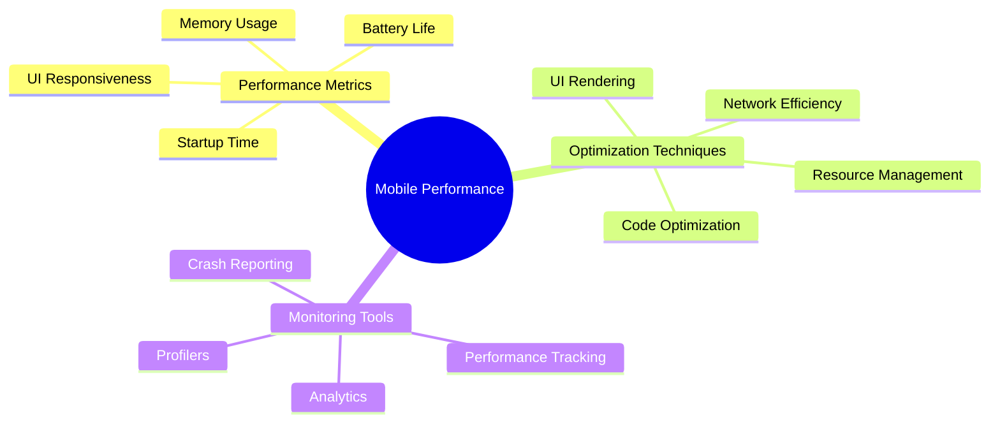

# Mobile App Performance

[Back to Course Content](README.md) | [Previous: Deployment](deployment.md) | [Next: Mobile App Analytics →](analytics.md)

> Reference: This content is based on 11.pdf

## What is Mobile App Performance?

Mobile app performance refers to how efficiently a mobile application uses system resources, responds to user interactions, and provides a smooth user experience. It encompasses various aspects such as startup time, memory usage, battery consumption, and UI responsiveness.



## Performance Metrics

### 1. Startup Time Optimization

```kotlin
// Example: Android App Startup Optimization
class App : Application() {
    override fun onCreate() {
        // Enable strict mode in debug builds
        if (BuildConfig.DEBUG) {
            StrictMode.enableDefaults()
        }
        
        // Initialize components asynchronously
        lifecycleScope.launch {
            initializeComponents()
        }
    }
    
    private suspend fun initializeComponents() {
        withContext(Dispatchers.IO) {
            // Initialize non-critical components
            initializeAnalytics()
            initializeCrashReporting()
            initializePushNotifications()
        }
    }
}
```

### 2. Memory Management

```swift
// Example: iOS Memory Management
class MemoryManager {
    func optimizeMemoryUsage() {
        // Clear image cache
        ImageCache.shared.clearCache()
        
        // Release unused resources
        NotificationCenter.default.removeObserver(self)
        
        // Clear temporary files
        clearTemporaryFiles()
        
        // Optimize database
        optimizeDatabase()
    }
    
    private func clearTemporaryFiles() {
        let tempDir = FileManager.default.temporaryDirectory
        try? FileManager.default.removeItem(at: tempDir)
        try? FileManager.default.createDirectory(at: tempDir, withIntermediateDirectories: true)
    }
}
```

## UI Performance

### 1. List Optimization

```dart
// Example: Flutter List Optimization
class OptimizedListView extends StatelessWidget {
  @override
  Widget build(BuildContext context) {
    return ListView.builder(
      itemCount: items.length,
      // Use const for static widgets
      itemBuilder: (context, index) => const ListItem(),
      // Add cache extent for better scrolling
      cacheExtent: 1000,
      // Use addAutomaticKeepAlives for frequently accessed items
      addAutomaticKeepAlives: true,
      // Implement pagination
      controller: ScrollController(
        onScroll: () {
          if (scrollController.position.pixels >=
              scrollController.position.maxScrollExtent - 200) {
            loadMoreItems();
          }
        },
      ),
    );
  }
}
```

### 2. Image Optimization

```kotlin
// Example: Android Image Optimization
class ImageOptimizer {
    fun loadOptimizedImage(imageView: ImageView, url: String) {
        Glide.with(imageView.context)
            .load(url)
            .apply(RequestOptions()
                .placeholder(R.drawable.placeholder)
                .error(R.drawable.error)
                .diskCacheStrategy(DiskCacheStrategy.ALL)
                .format(DecodeFormat.PREFER_RGB_565)
                .override(500, 500)
                .centerCrop())
            .into(imageView)
    }
    
    fun preloadImages(urls: List<String>) {
        urls.forEach { url ->
            Glide.with(context)
                .load(url)
                .preload()
        }
    }
}
```

## Network Optimization

### 1. Request Caching

```swift
// Example: iOS Network Caching
class NetworkCache {
    private let cache = URLCache.shared
    private let memoryCapacity = 50 * 1024 * 1024 // 50 MB
    private let diskCapacity = 100 * 1024 * 1024 // 100 MB
    
    init() {
        cache = URLCache(
            memoryCapacity: memoryCapacity,
            diskCapacity: diskCapacity,
            directory: nil
        )
    }
    
    func cachedResponse(for request: URLRequest) -> CachedURLResponse? {
        return cache.cachedResponse(for: request)
    }
    
    func storeCachedResponse(_ response: CachedURLResponse, for request: URLRequest) {
        cache.storeCachedResponse(response, for: request)
    }
}
```

### 2. Request Batching

```dart
// Example: Flutter Request Batching
class BatchedApiClient {
  final _batchQueue = <ApiRequest>[];
  Timer? _batchTimer;
  
  Future<void> sendRequest(ApiRequest request) async {
    _batchQueue.add(request);
    
    _batchTimer?.cancel();
    _batchTimer = Timer(const Duration(milliseconds: 100), () {
      _processBatch();
    });
  }
  
  Future<void> _processBatch() async {
    if (_batchQueue.isEmpty) return;
    
    final batch = _batchQueue.toList();
    _batchQueue.clear();
    
    try {
      final response = await _api.sendBatch(batch);
      _handleBatchResponse(response);
    } catch (e) {
      _handleBatchError(e);
    }
  }
}
```

## Battery Optimization

### 1. Background Tasks

```kotlin
// Example: Android Background Task Optimization
class BackgroundTaskManager {
    fun scheduleBackgroundTask() {
        val constraints = Constraints.Builder()
            .setRequiredNetworkType(NetworkType.CONNECTED)
            .setRequiresBatteryNotLow(true)
            .build()
            
        val workRequest = OneTimeWorkRequestBuilder<BackgroundWorker>()
            .setConstraints(constraints)
            .setBackoffCriteria(
                BackoffPolicy.LINEAR,
                Duration.ofMinutes(15)
            )
            .build()
            
        WorkManager.getInstance(context)
            .enqueueUniqueWork(
                "background_task",
                ExistingWorkPolicy.REPLACE,
                workRequest
            )
    }
}
```

### 2. Location Updates

```swift
// Example: iOS Location Updates Optimization
class LocationManager {
    private let locationManager = CLLocationManager()
    
    func startLocationUpdates() {
        locationManager.desiredAccuracy = kCLLocationAccuracyHundredMeters
        locationManager.distanceFilter = 100 // meters
        locationManager.allowsBackgroundLocationUpdates = true
        locationManager.pausesLocationUpdatesAutomatically = true
        
        locationManager.startUpdatingLocation()
    }
    
    func stopLocationUpdates() {
        locationManager.stopUpdatingLocation()
    }
}
```

## Performance Monitoring

### 1. Performance Tracking

```dart
// Example: Flutter Performance Tracking
class PerformanceTracker {
  static final _instance = PerformanceTracker._internal();
  factory PerformanceTracker() => _instance;
  PerformanceTracker._internal();
  
  void trackFrameTime(Duration frameTime) {
    if (frameTime.inMilliseconds > 16) { // 60fps threshold
      _reportFrameDrop(frameTime);
    }
  }
  
  void trackMemoryUsage() {
    final usage = ProcessInfo.currentRss;
    if (usage > 100 * 1024 * 1024) { // 100MB threshold
      _reportHighMemoryUsage(usage);
    }
  }
  
  void _reportFrameDrop(Duration frameTime) {
    analytics.logEvent('frame_drop', parameters: {
      'duration': frameTime.inMilliseconds,
      'timestamp': DateTime.now().millisecondsSinceEpoch,
    });
  }
}
```

### 2. Crash Reporting

```kotlin
// Example: Android Crash Reporting
class CrashReporter {
    fun initialize() {
        FirebaseCrashlytics.getInstance().apply {
            setCrashlyticsCollectionEnabled(true)
            setCustomKey("app_version", BuildConfig.VERSION_NAME)
            setCustomKey("build_number", BuildConfig.VERSION_CODE)
        }
    }
    
    fun reportPerformanceIssue(metric: String, value: Any) {
        FirebasePerformance.getInstance().newTrace("performance_issue").apply {
            putMetric(metric, value)
            start()
            stop()
        }
    }
}
```

## Best Practices

1. **Code Optimization**
   - Use efficient algorithms
   - Implement proper caching
   - Optimize resource usage
   - Minimize object creation

2. **UI Optimization**
   - Implement lazy loading
   - Use view recycling
   - Optimize layouts
   - Minimize redraws

3. **Network Optimization**
   - Implement caching
   - Use request batching
   - Optimize payload size
   - Handle offline mode

## Common Performance Issues

1. **Memory Issues**
   - Memory leaks
   - Large heap allocations
   - Unnecessary object creation
   - Resource leaks

2. **UI Issues**
   - Frame drops
   - Layout thrashing
   - Heavy animations
   - Complex layouts

3. **Network Issues**
   - Slow requests
   - Large payloads
   - Frequent requests
   - Poor error handling

## Exercises

1. Optimize app startup
2. Implement memory management
3. Optimize UI performance
4. Improve network efficiency
5. Monitor app performance

## Additional Resources

- [Android Performance Guide](https://developer.android.com/topic/performance)
- [iOS Performance Guide](https://developer.apple.com/library/archive/documentation/Performance/Conceptual/PerformanceOverview/Introduction/Introduction.html)
- [Flutter Performance Guide](https://flutter.dev/docs/perf/rendering)
- [Mobile App Performance Best Practices](https://developer.android.com/topic/performance/optimization) 