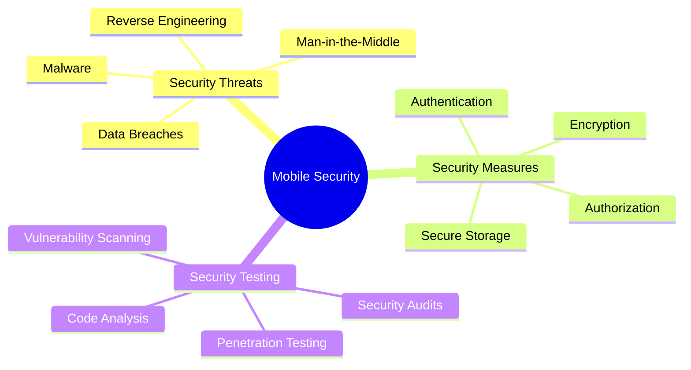

# Mobile App Security

[Back to Course Content](README.md) | [Previous: Development](development.md) | [Next: Mobile App Testing →](testing.md)

> Reference: This content is based on 9.pdf and 10.pdf

## What is Mobile App Security?

Mobile app security refers to the measures and practices implemented to protect mobile applications from various security threats and vulnerabilities. It encompasses data protection, authentication, authorization, and secure communication.



## Security Fundamentals

### 1. Data Encryption

```kotlin
// Example: Android Data Encryption
class SecurityManager {
    private val keyStore = KeyStore.getInstance("AndroidKeyStore")
    private val keyAlias = "AppKey"
    
    init {
        keyStore.load(null)
        if (!keyStore.containsAlias(keyAlias)) {
            val keyGenerator = KeyGenerator.getInstance(
                KeyProperties.KEY_ALGORITHM_AES,
                "AndroidKeyStore"
            )
            keyGenerator.init(
                KeyGenParameterSpec.Builder(
                    keyAlias,
                    KeyProperties.PURPOSE_ENCRYPT or KeyProperties.PURPOSE_DECRYPT
                )
                .setBlockModes(KeyProperties.BLOCK_MODE_CBC)
                .setEncryptionPaddings(KeyProperties.ENCRYPTION_PADDING_PKCS7)
                .setUserAuthenticationRequired(false)
                .build()
            )
            keyGenerator.generateKey()
        }
    }
    
    fun encrypt(data: String): String {
        val cipher = Cipher.getInstance(
            "${KeyProperties.KEY_ALGORITHM_AES}/${KeyProperties.BLOCK_MODE_CBC}/${KeyProperties.ENCRYPTION_PADDING_PKCS7}"
        )
        cipher.init(Cipher.ENCRYPT_MODE, keyStore.getKey(keyAlias, null))
        return Base64.encodeToString(cipher.doFinal(data.toByteArray()), Base64.DEFAULT)
    }
}
```

### 2. Secure Storage

```swift
// Example: iOS Secure Storage
class SecureStorage {
    private let keychain = KeychainWrapper.standard
    
    func saveSecureData(_ data: String, forKey key: String) throws {
        let query: [String: Any] = [
            kSecClass as String: kSecClassGenericPassword,
            kSecAttrAccount as String: key,
            kSecValueData as String: data.data(using: .utf8)!,
            kSecAttrAccessible as String: kSecAttrAccessibleWhenUnlocked
        ]
        
        let status = SecItemAdd(query as CFDictionary, nil)
        guard status == errSecSuccess else {
            throw KeychainError.saveFailed(status)
        }
    }
    
    func getSecureData(forKey key: String) throws -> String {
        let query: [String: Any] = [
            kSecClass as String: kSecClassGenericPassword,
            kSecAttrAccount as String: key,
            kSecReturnData as String: true
        ]
        
        var result: AnyObject?
        let status = SecItemCopyMatching(query as CFDictionary, &result)
        
        guard status == errSecSuccess,
              let data = result as? Data,
              let string = String(data: data, encoding: .utf8) else {
            throw KeychainError.retrieveFailed(status)
        }
        
        return string
    }
}
```

## Authentication & Authorization

### 1. Biometric Authentication

```dart
// Example: Flutter Biometric Authentication
class BiometricAuth {
  final LocalAuthentication _localAuth = LocalAuthentication();
  
  Future<bool> authenticate() async {
    try {
      final canAuthenticateWithBiometrics = await _localAuth.canCheckBiometrics;
      final canAuthenticate = canAuthenticateWithBiometrics || await _localAuth.isDeviceSupported();
      
      if (!canAuthenticate) {
        return false;
      }
      
      return await _localAuth.authenticate(
        localizedReason: 'Please authenticate to access the app',
        options: const AuthenticationOptions(
          stickyAuth: true,
          biometricOnly: true,
        ),
      );
    } catch (e) {
      print('Error during authentication: $e');
      return false;
    }
  }
}
```

### 2. Token Management

```kotlin
// Example: Android Token Management
class TokenManager {
    private val encryptedSharedPrefs = EncryptedSharedPreferences.create(
        "secure_prefs",
        MasterKey.Builder(context)
            .setKeyScheme(MasterKey.KeyScheme.AES256_GCM)
            .build(),
        EncryptedSharedPreferences.PrefKeyEncryptionScheme.AES256_SIV,
        EncryptedSharedPreferences.PrefValueEncryptionScheme.AES256_GCM
    )
    
    fun saveToken(token: String) {
        encryptedSharedPrefs.edit()
            .putString("auth_token", token)
            .apply()
    }
    
    fun getToken(): String? {
        return encryptedSharedPrefs.getString("auth_token", null)
    }
    
    fun clearToken() {
        encryptedSharedPrefs.edit()
            .remove("auth_token")
            .apply()
    }
}
```

## Network Security

### 1. SSL Pinning

```swift
// Example: iOS SSL Pinning
class SSLPinningDelegate: NSObject, URLSessionDelegate {
    func urlSession(
        _ session: URLSession,
        didReceive challenge: URLAuthenticationChallenge,
        completionHandler: @escaping (URLSession.AuthChallengeDisposition, URLCredential?) -> Void
    ) {
        guard let serverTrust = challenge.protectionSpace.serverTrust else {
            completionHandler(.cancelAuthenticationChallenge, nil)
            return
        }
        
        let certificate = SecTrustGetCertificateAtIndex(serverTrust, 0)
        let serverCertificateData = SecCertificateCopyData(certificate!)
        let data = CFDataGetBytePtr(serverCertificateData)
        let size = CFDataGetLength(serverCertificateData)
        let serverCertificate = NSData(bytes: data, length: size)
        
        // Compare with stored certificate
        if serverCertificate.isEqual(to: storedCertificate) {
            let credential = URLCredential(trust: serverTrust)
            completionHandler(.useCredential, credential)
        } else {
            completionHandler(.cancelAuthenticationChallenge, nil)
        }
    }
}
```

### 2. Secure API Communication

```dart
// Example: Flutter Secure API Communication
class SecureApiClient {
  final Dio _dio;
  
  SecureApiClient() {
    _dio = Dio(BaseOptions(
      baseUrl: 'https://api.example.com',
      connectTimeout: const Duration(seconds: 5),
      receiveTimeout: const Duration(seconds: 3),
    ));
    
    _dio.interceptors.add(InterceptorsWrapper(
      onRequest: (options, handler) async {
        // Add security headers
        options.headers['X-Security-Token'] = await getSecurityToken();
        return handler.next(options);
      },
      onError: (error, handler) {
        // Handle security-related errors
        if (error.response?.statusCode == 401) {
          handleUnauthorized();
        }
        return handler.next(error);
      },
    ));
  }
  
  Future<Response> secureRequest(String path, dynamic data) async {
    try {
      return await _dio.post(
        path,
        data: data,
        options: Options(
          validateStatus: (status) => status! < 500,
          headers: {
            'Content-Type': 'application/json',
            'X-Request-ID': generateRequestId(),
          },
        ),
      );
    } catch (e) {
      throw SecurityException('Secure request failed: $e');
    }
  }
}
```

## Security Testing

### 1. Vulnerability Scanning

```kotlin
// Example: Android Security Scanner
class SecurityScanner {
    fun scanApp(context: Context) {
        // Check for root
        if (isDeviceRooted()) {
            reportVulnerability("Device is rooted")
        }
        
        // Check for debug mode
        if (BuildConfig.DEBUG) {
            reportVulnerability("App is in debug mode")
        }
        
        // Check for emulator
        if (isEmulator()) {
            reportVulnerability("Running on emulator")
        }
        
        // Check for screen recording
        if (isScreenRecording()) {
            reportVulnerability("Screen recording detected")
        }
    }
    
    private fun reportVulnerability(message: String) {
        Log.w("SecurityScanner", "Vulnerability detected: $message")
        // Report to security monitoring service
    }
}
```

### 2. Code Analysis

```swift
// Example: iOS Security Analyzer
class SecurityAnalyzer {
    func analyzeCode() {
        // Check for hardcoded secrets
        checkForHardcodedSecrets()
        
        // Check for weak encryption
        checkEncryptionStrength()
        
        // Check for insecure storage
        checkStorageSecurity()
        
        // Check for network security
        checkNetworkSecurity()
    }
    
    private func checkForHardcodedSecrets() {
        let patterns = [
            "password",
            "secret",
            "key",
            "token"
        ]
        
        // Scan codebase for hardcoded values
        for pattern in patterns {
            if let matches = findPattern(pattern) {
                reportIssue("Hardcoded secret found: \(matches)")
            }
        }
    }
}
```

## Best Practices

1. **Data Protection**
   - Encrypt sensitive data
   - Use secure storage
   - Implement proper key management
   - Follow data minimization principles

2. **Authentication**
   - Implement strong authentication
   - Use biometric authentication
   - Secure token management
   - Implement proper session handling

3. **Network Security**
   - Use SSL/TLS
   - Implement certificate pinning
   - Secure API communication
   - Handle network errors properly

## Common Security Issues

1. **Data Security**
   - Unencrypted storage
   - Weak encryption
   - Insecure key storage
   - Data leakage

2. **Authentication Issues**
   - Weak passwords
   - Insecure token storage
   - Missing authentication
   - Session management issues

3. **Network Security**
   - Unencrypted communication
   - Missing SSL pinning
   - Insecure API endpoints
   - Man-in-the-middle attacks

## Exercises

1. Implement secure data storage
2. Set up SSL pinning
3. Add biometric authentication
4. Perform security testing
5. Fix common vulnerabilities

## Additional Resources

- [OWASP Mobile Security Testing Guide](https://owasp.org/www-project-mobile-security-testing-guide/)
- [Android Security Best Practices](https://developer.android.com/topic/security)
- [iOS Security Guide](https://support.apple.com/guide/security/welcome/web)
- [Mobile App Security Checklist](https://www.owasp.org/index.php/Mobile_App_Security_Checklist) 