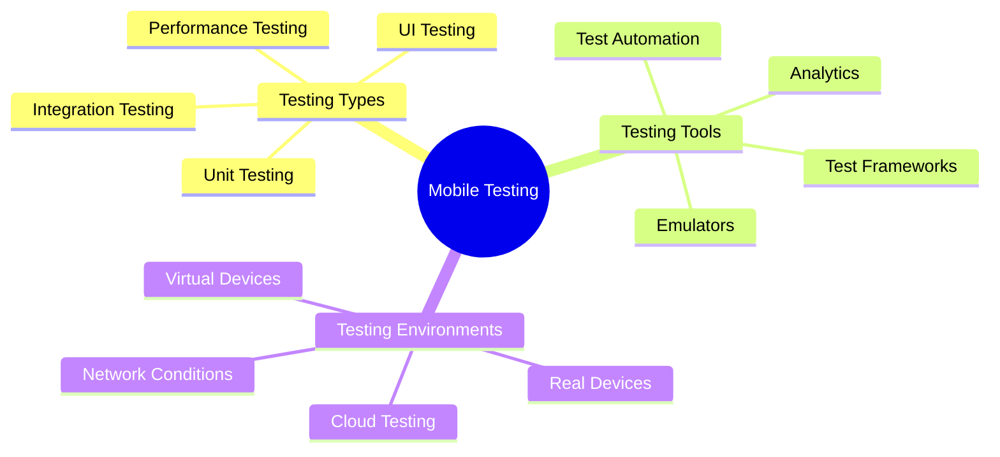

# Mobile App Testing

[Back to Course Content](README.md) | [Previous: Security](security.md) | [Next: Mobile App Deployment →](deployment.md)

> Reference: This content is based on 11.pdf

## What is Mobile App Testing?

Mobile app testing is the process of verifying the functionality, usability, and consistency of mobile applications across different devices, platforms, and network conditions. It ensures that the app meets quality standards and provides a good user experience.



## Testing Types

### 1. Unit Testing

```kotlin
// Example: Android Unit Testing
class UserRepositoryTest {
    private lateinit var repository: UserRepository
    private lateinit var api: MockApiService
    private lateinit var db: MockDatabase
    
    @Before
    fun setup() {
        api = MockApiService()
        db = MockDatabase()
        repository = UserRepository(api, db)
    }
    
    @Test
    fun `getUser returns cached user when available`() {
        // Arrange
        val user = User(id = "1", name = "Test User")
        db.saveUser(user)
        
        // Act
        val result = runBlocking { repository.getUser("1") }
        
        // Assert
        assertEquals(user, result)
        verify(api, never()).getUser(any())
    }
    
    @Test
    fun `getUser fetches from API when not cached`() {
        // Arrange
        val user = User(id = "1", name = "Test User")
        whenever(api.getUser("1")).thenReturn(user)
        
        // Act
        val result = runBlocking { repository.getUser("1") }
        
        // Assert
        assertEquals(user, result)
        verify(api).getUser("1")
    }
}
```

### 2. UI Testing

```swift
// Example: iOS UI Testing
class LoginUITests: XCTestCase {
    var app: XCUIApplication!
    
    override func setUpWithError() throws {
        continueAfterFailure = false
        app = XCUIApplication()
        app.launch()
    }
    
    func testLoginFlow() throws {
        // Test login form
        let usernameTextField = app.textFields["username"]
        XCTAssertTrue(usernameTextField.exists)
        usernameTextField.tap()
        usernameTextField.typeText("testuser")
        
        let passwordTextField = app.secureTextFields["password"]
        XCTAssertTrue(passwordTextField.exists)
        passwordTextField.tap()
        passwordTextField.typeText("password123")
        
        let loginButton = app.buttons["login"]
        XCTAssertTrue(loginButton.exists)
        loginButton.tap()
        
        // Verify successful login
        let welcomeLabel = app.staticTexts["Welcome"]
        XCTAssertTrue(welcomeLabel.waitForExistence(timeout: 5))
    }
    
    func testErrorHandling() throws {
        // Test invalid credentials
        let usernameTextField = app.textFields["username"]
        usernameTextField.tap()
        usernameTextField.typeText("invalid")
        
        let passwordTextField = app.secureTextFields["password"]
        passwordTextField.tap()
        passwordTextField.typeText("wrong")
        
        app.buttons["login"].tap()
        
        // Verify error message
        let errorLabel = app.staticTexts["Invalid credentials"]
        XCTAssertTrue(errorLabel.waitForExistence(timeout: 5))
    }
}
```

### 3. Integration Testing

```dart
// Example: Flutter Integration Testing
void main() {
  IntegrationTestWidgetsFlutterBinding.ensureInitialized();
  
  testWidgets('Complete user flow test', (WidgetTester tester) async {
    // Build app
    await tester.pumpWidget(MyApp());
    
    // Test login
    await tester.enterText(find.byType(TextField), 'testuser');
    await tester.enterText(find.byType(TextFormField), 'password123');
    await tester.tap(find.byType(ElevatedButton));
    await tester.pumpAndSettle();
    
    // Verify home screen
    expect(find.text('Welcome'), findsOneWidget);
    
    // Test navigation
    await tester.tap(find.byIcon(Icons.person));
    await tester.pumpAndSettle();
    
    // Verify profile screen
    expect(find.text('Profile'), findsOneWidget);
    
    // Test logout
    await tester.tap(find.text('Logout'));
    await tester.pumpAndSettle();
    
    // Verify login screen
    expect(find.text('Login'), findsOneWidget);
  });
}
```

## Test Automation

### 1. Test Runner Setup

```kotlin
// Example: Android Test Runner
@RunWith(AndroidJUnit4::class)
class InstrumentedTest {
    @get:Rule
    val activityRule = ActivityScenarioRule(MainActivity::class.java)
    
    @Test
    fun testUserFlow() {
        // Test user registration
        onView(withId(R.id.registerButton))
            .perform(click())
        
        onView(withId(R.id.usernameInput))
            .perform(typeText("testuser"))
        
        onView(withId(R.id.passwordInput))
            .perform(typeText("password123"))
        
        onView(withId(R.id.submitButton))
            .perform(click())
        
        // Verify registration success
        onView(withId(R.id.successMessage))
            .check(matches(isDisplayed()))
    }
}
```

### 2. Test Data Management

```swift
// Example: iOS Test Data Management
class TestDataManager {
    static let shared = TestDataManager()
    
    func setupTestData() {
        // Clear existing data
        clearDatabase()
        
        // Insert test data
        insertTestUsers()
        insertTestProducts()
        insertTestOrders()
    }
    
    private func insertTestUsers() {
        let users = [
            User(id: "1", name: "Test User 1", email: "test1@example.com"),
            User(id: "2", name: "Test User 2", email: "test2@example.com")
        ]
        
        for user in users {
            try? database.insert(user)
        }
    }
    
    func clearDatabase() {
        try? database.deleteAll()
    }
}
```

## Performance Testing

### 1. Memory Testing

```dart
// Example: Flutter Memory Testing
void main() {
  testWidgets('Memory leak test', (WidgetTester tester) async {
    // Initial memory usage
    final initialMemory = await getMemoryUsage();
    
    // Build and dispose widget multiple times
    for (var i = 0; i < 100; i++) {
      await tester.pumpWidget(MyWidget());
      await tester.pumpAndSettle();
      await tester.pumpWidget(Container()); // Dispose
      await tester.pumpAndSettle();
    }
    
    // Final memory usage
    final finalMemory = await getMemoryUsage();
    
    // Check for memory leak
    expect(finalMemory - initialMemory, lessThan(1024 * 1024)); // Less than 1MB
  });
}

Future<int> getMemoryUsage() async {
  final usage = await ProcessInfo.currentRss;
  return usage;
}
```

### 2. Network Testing

```kotlin
// Example: Android Network Testing
class NetworkTest {
    @Test
    fun testNetworkPerformance() {
        val client = OkHttpClient.Builder()
            .connectTimeout(5, TimeUnit.SECONDS)
            .readTimeout(5, TimeUnit.SECONDS)
            .build()
        
        val request = Request.Builder()
            .url("https://api.example.com/test")
            .build()
        
        val startTime = System.currentTimeMillis()
        
        client.newCall(request).execute().use { response ->
            val endTime = System.currentTimeMillis()
            val duration = endTime - startTime
            
            assertTrue(duration < 1000) // Response time should be less than 1 second
            assertTrue(response.isSuccessful)
        }
    }
}
```

## Best Practices

1. **Test Planning**
   - Define test objectives
   - Create test cases
   - Set up test environment
   - Prepare test data

2. **Test Execution**
   - Run automated tests
   - Perform manual testing
   - Document test results
   - Track test coverage

3. **Test Maintenance**
   - Update test cases
   - Refactor test code
   - Review test results
   - Optimize test suite

## Common Testing Issues

1. **Test Environment**
   - Device fragmentation
   - Platform differences
   - Network conditions
   - Test data management

2. **Test Automation**
   - Flaky tests
   - Slow test execution
   - Maintenance overhead
   - False positives

3. **Performance Testing**
   - Memory leaks
   - Battery drain
   - Network latency
   - UI responsiveness

## Exercises

1. Write unit tests
2. Implement UI tests
3. Set up test automation
4. Perform performance testing
5. Create test data

## Additional Resources

- [Android Testing Guide](https://developer.android.com/training/testing)
- [iOS Testing Guide](https://developer.apple.com/library/archive/documentation/DeveloperTools/Conceptual/testing_with_xcode/chapters/01-introduction.html)
- [Flutter Testing Guide](https://flutter.dev/docs/testing)
- [Mobile Testing Best Practices](https://www.softwaretestinghelp.com/mobile-app-testing/) 