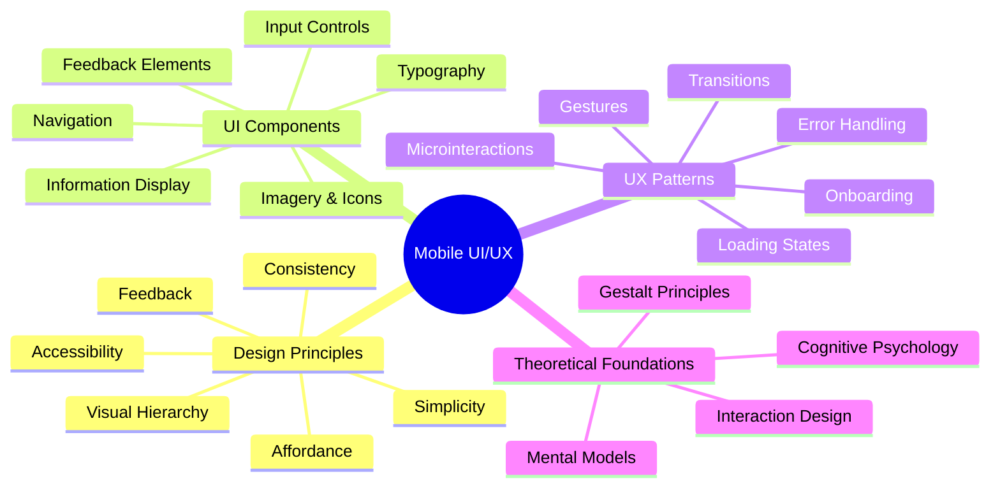

# Mobile UI/UX Design

[Back to Course Content](README.md) | [Previous: Introduction](introduction.md) | [Next: Mobile App Architecture →](architecture.md)

> Reference: This content is based on 3.pdf and 4.pdf

## What is Mobile UI/UX Design?

Mobile UI/UX design focuses on creating intuitive, efficient, and visually appealing interfaces for mobile applications. It combines user interface design principles with user experience considerations to create interfaces that not only look appealing but also function effectively in the context of mobile interactions and constraints.

- **UI (User Interface)**: The visual components and interactive elements users engage with
- **UX (User Experience)**: The overall feel, efficiency, and satisfaction users experience when using the application



## Theoretical Foundations of Mobile UI/UX

### 1. Cognitive Psychology Principles

Mobile UI/UX design is deeply rooted in cognitive psychology, which studies how people perceive, process, and act upon information.

#### Key Cognitive Principles:

- **Cognitive Load Theory**: Users have limited mental processing capacity. Interfaces should minimize cognitive load through:
  - Breaking complex tasks into simpler steps
  - Using recognition rather than recall
  - Providing clear feedback and visual cues
  - Utilizing familiar patterns and conventions

- **Attention**: Human attention is limited and selective
  - Users typically focus on one primary task
  - Visual hierarchy directs attention to important elements
  - Motion and color changes attract attention
  - Users scan interfaces in predictable patterns (F-pattern, Z-pattern)

- **Mental Models**: Users have preconceived notions about how systems work
  - Design should align with users' existing mental models
  - Use familiar metaphors and patterns
  - Provide conceptual consistency across the application

#### Application in Mobile Design:

```swift
// Example: Reducing Cognitive Load in iOS
class SimplifiedTaskViewController: UIViewController {
    // Using segmented control to limit choices
    private let actionSelector: UISegmentedControl = {
        let actions = ["View", "Edit", "Share"]
        let control = UISegmentedControl(items: actions)
        control.selectedSegmentIndex = 0
        return control
    }()
    
    // Providing clear visual feedback
    private func showFeedback(for action: String) {
        let feedback = UINotificationFeedbackGenerator()
        feedback.notificationOccurred(.success)
        
        let alert = UIAlertController(
            title: "Action Completed",
            message: "\(action) operation was successful",
            preferredStyle: .alert
        )
        alert.addAction(UIAlertAction(title: "OK", style: .default))
        present(alert, animated: true)
    }
}
```

### 2. Gestalt Principles in Mobile Design

Gestalt psychology explains how humans perceive the whole as different from the sum of its parts. These principles are fundamental to creating organized, coherent visual interfaces.

#### Core Gestalt Principles:

- **Proximity**: Elements placed close to each other are perceived as related
- **Similarity**: Similar elements are perceived as related or belonging to the same group
- **Continuity**: Elements arranged in a line or curve are perceived as related
- **Closure**: The mind fills in gaps to perceive complete shapes
- **Figure/Ground**: Objects are perceived as either figures (elements of focus) or ground (background)
- **Common Fate**: Elements moving in the same direction are perceived as related

#### Mobile Implementation Examples:

```dart
// Example: Flutter Proximity and Similarity Principles
class GestaltPrinciplesDemo extends StatelessWidget {
  @override
  Widget build(BuildContext context) {
    return Column(
      children: [
        // Proximity example: Related items grouped together
        Padding(
          padding: EdgeInsets.all(16.0),
          child: Row(
            mainAxisAlignment: MainAxisAlignment.center,
            children: [
              // First group (closely spaced)
              Icon(Icons.camera),
              Icon(Icons.edit),
              Icon(Icons.crop),
              SizedBox(width: 32), // Space between groups
              // Second group (closely spaced)
              Icon(Icons.share),
              Icon(Icons.send),
              Icon(Icons.cloud_upload),
            ],
          ),
        ),
        
        // Similarity example: Similar items are perceived as related
        Padding(
          padding: EdgeInsets.all(16.0),
          child: Row(
            mainAxisAlignment: MainAxisAlignment.spaceEvenly,
            children: [
              // First group (same shape/color)
              Icon(Icons.star, color: Colors.blue),
              Icon(Icons.favorite, color: Colors.blue),
              Icon(Icons.thumb_up, color: Colors.blue),
              // Second group (different shape/color)
              Icon(Icons.delete, color: Colors.red),
              Icon(Icons.warning, color: Colors.red),
              Icon(Icons.block, color: Colors.red),
            ],
          ),
        ),
      ],
    );
  }
}
```

### 3. Visual Hierarchy and Information Architecture

Visual hierarchy establishes the relative importance of elements in an interface, guiding users' attention and creating a logical flow through the content.

#### Key Principles:

- **Size and Scale**: Larger elements appear more important
- **Color and Contrast**: Higher contrast elements attract more attention
- **Typography Hierarchy**: Headings, subheadings, and body text establish content structure
- **Whitespace**: Strategic use of negative space highlights important elements and improves readability
- **F-Pattern and Z-Pattern**: Users scan content in predictable patterns

#### Application in Mobile Design:

```java
// Example: Android Visual Hierarchy
public class VisualHierarchyActivity extends AppCompatActivity {
    @Override
    protected void onCreate(Bundle savedInstanceState) {
        super.onCreate(savedInstanceState);
        setContentView(R.layout.activity_visual_hierarchy);
        
        // Setting up typography hierarchy
        TextView heading = findViewById(R.id.heading);
        TextView subheading = findViewById(R.id.subheading);
        TextView body = findViewById(R.id.body);
        
        heading.setTextSize(TypedValue.COMPLEX_UNIT_SP, 24);
        heading.setTypeface(heading.getTypeface(), Typeface.BOLD);
        
        subheading.setTextSize(TypedValue.COMPLEX_UNIT_SP, 18);
        subheading.setTypeface(subheading.getTypeface(), Typeface.ITALIC);
        
        body.setTextSize(TypedValue.COMPLEX_UNIT_SP, 16);
        
        // Creating visual prominence for primary action
        Button primaryButton = findViewById(R.id.primary_button);
        Button secondaryButton = findViewById(R.id.secondary_button);
        
        primaryButton.setBackgroundColor(getResources().getColor(R.color.primary));
        primaryButton.setTextColor(Color.WHITE);
        
        secondaryButton.setBackgroundColor(Color.TRANSPARENT);
        secondaryButton.setTextColor(getResources().getColor(R.color.primary));
    }
}
```

## Design Principles

### 1. Material Design (Android)

Material Design is Google's comprehensive design system for creating unified experiences across platforms and device sizes. It's based on tactile reality-inspired principles while maintaining the flexibility of digital interfaces.

#### Core Material Design Principles:

- **Material as a metaphor**: Interfaces behave like physical materials with surfaces, edges, and shadows
- **Bold, graphic, intentional**: Deliberate color choices, edge-to-edge imagery, and large-scale typography
- **Motion provides meaning**: Animation reinforces user actions and shows relationships
- **Adaptive design**: Responsive layouts that work across different screen sizes

```xml
<!-- Example: Material Design Components -->
<?xml version="1.0" encoding="utf-8"?>
<androidx.coordinatorlayout.widget.CoordinatorLayout
    xmlns:android="http://schemas.android.com/apk/res/android"
    xmlns:app="http://schemas.android.com/apk/res-auto"
    android:layout_width="match_parent"
    android:layout_height="match_parent">

    <com.google.android.material.appbar.AppBarLayout
        android:layout_width="match_parent"
        android:layout_height="wrap_content">

        <com.google.android.material.appbar.MaterialToolbar
            android:id="@+id/toolbar"
            android:layout_width="match_parent"
            android:layout_height="?attr/actionBarSize"
            app:title="My App" />

    </com.google.android.material.appbar.AppBarLayout>

    <androidx.core.widget.NestedScrollView
        android:layout_width="match_parent"
        android:layout_height="match_parent"
        app:layout_behavior="@string/appbar_scrolling_view_behavior">

        <LinearLayout
            android:layout_width="match_parent"
            android:layout_height="wrap_content"
            android:orientation="vertical"
            android:padding="16dp">

            <com.google.android.material.textfield.TextInputLayout
                android:layout_width="match_parent"
                android:layout_height="wrap_content"
                android:hint="Username"
                style="@style/Widget.MaterialComponents.TextInputLayout.OutlinedBox">

                <com.google.android.material.textfield.TextInputEditText
                    android:layout_width="match_parent"
                    android:layout_height="wrap_content"
                    android:inputType="text" />

            </com.google.android.material.textfield.TextInputLayout>

            <com.google.android.material.button.MaterialButton
                android:layout_width="match_parent"
                android:layout_height="wrap_content"
                android:text="Submit"
                android:layout_marginTop="16dp" />

        </LinearLayout>

    </androidx.core.widget.NestedScrollView>

</androidx.coordinatorlayout.widget.CoordinatorLayout>
```

### 2. Human Interface Guidelines (iOS)

Apple's Human Interface Guidelines (HIG) provide a comprehensive framework for designing intuitive, consistent experiences across Apple's platforms. The guidelines emphasize clarity, deference, and depth.

#### Core HIG Principles:

- **Clarity**: Text is legible, icons are precise and lucid, decorations are subtle and appropriate
- **Deference**: Fluid motion and crisp interfaces help people understand content
- **Depth**: Visual layers and realistic motion convey hierarchy and facilitate understanding

#### iOS Design Themes:

- **Aesthetic Integrity**: How well the appearance integrates with function
- **Consistency**: Implementation of familiar standards and paradigms
- **Direct Manipulation**: Users directly interact with on-screen content
- **Feedback**: Responses to actions and demonstrable results
- **Metaphors**: Virtual objects and actions that correspond to the physical world
- **User Control**: The user, not the app, should initiate and control actions

```swift
// Example: iOS UI Components following HIG
class LoginViewController: UIViewController {
    private let stackView: UIStackView = {
        let stack = UIStackView()
        stack.axis = .vertical
        stack.spacing = 16
        stack.translatesAutoresizingMaskIntoConstraints = false
        return stack
    }()
    
    private let usernameField: UITextField = {
        let field = UITextField()
        field.placeholder = "Username"
        field.borderStyle = .roundedRect
        field.autocapitalizationType = .none
        return field
    }()
    
    private let loginButton: UIButton = {
        let button = UIButton(type: .system)
        button.setTitle("Login", for: .normal)
        button.backgroundColor = .systemBlue
        button.setTitleColor(.white, for: .normal)
        button.layer.cornerRadius = 8
        return button
    }()
    
    override func viewDidLoad() {
        super.viewDidLoad()
        setupUI()
    }
    
    private func setupUI() {
        view.backgroundColor = .systemBackground
        view.addSubview(stackView)
        
        stackView.addArrangedSubview(usernameField)
        stackView.addArrangedSubview(loginButton)
        
        NSLayoutConstraint.activate([
            stackView.centerYAnchor.constraint(equalTo: view.centerYAnchor),
            stackView.leadingAnchor.constraint(equalTo: view.leadingAnchor, constant: 32),
            stackView.trailingAnchor.constraint(equalTo: view.trailingAnchor, constant: -32)
        ])
    }
}
```

### 3. Flutter Material Design

Flutter provides a rich set of Material Design widgets that implement Google's design system while maintaining flexibility for customization. It enables consistent experiences across platforms while respecting platform-specific idioms.

#### Flutter Design Principles:

- **Composition over inheritance**: Building complex UIs by combining simple widgets
- **Declarative UI**: Describing the UI state directly, letting Flutter handle rendering and transitions
- **Everything is a widget**: Unified approach to UI elements, layout, and interaction
- **Customization**: Extensive theming and styling capabilities

```dart
// Example: Flutter Material Design Components
class LoginScreen extends StatelessWidget {
  @override
  Widget build(BuildContext context) {
    return Scaffold(
      body: SafeArea(
        child: Padding(
          padding: const EdgeInsets.all(16.0),
          child: Column(
            mainAxisAlignment: MainAxisAlignment.center,
            crossAxisAlignment: CrossAxisAlignment.stretch,
            children: [
              TextField(
                decoration: InputDecoration(
                  labelText: 'Username',
                  border: OutlineInputBorder(),
                  prefixIcon: Icon(Icons.person),
                ),
              ),
              SizedBox(height: 16),
              ElevatedButton(
                onPressed: () {
                  // Handle login
                },
                child: Text('Login'),
                style: ElevatedButton.styleFrom(
                  padding: EdgeInsets.symmetric(vertical: 16),
                ),
              ),
            ],
          ),
        ),
      ),
    );
  }
}
```

### 4. Accessibility in Mobile Design

Accessibility ensures that applications are usable by people with diverse abilities, including those with visual, auditory, motor, or cognitive impairments.

#### Key Accessibility Guidelines (WCAG for Mobile):

- **Perceivable**: Information must be presentable to users in ways they can perceive
  - Provide text alternatives for non-text content
  - Ensure adequate color contrast (4.5:1 for normal text)
  - Make content adaptable to different display orientations
  - Use robust semantic markup for screen readers

- **Operable**: Interface components must be navigable and operable
  - All functionality must be accessible through keyboard or assistive technologies
  - Provide enough time for users to read and use content
  - Do not use content that could cause seizures or physical reactions
  - Help users navigate and find content

- **Understandable**: Information and operation must be understandable
  - Text should be readable and comprehensible
  - Interface should be predictable and consistent
  - Help users avoid and correct mistakes

- **Robust**: Content must be compatible with current and future technologies
  - Maximize compatibility with assistive technologies

```kotlin
// Example: Android Accessibility Implementation
class AccessibleActivity : AppCompatActivity() {
    override fun onCreate(savedInstanceState: Bundle?) {
        super.onCreate(savedInstanceState)
        setContentView(R.layout.accessible_layout)
        
        // Setting content descriptions
        val imageView = findViewById<ImageView>(R.id.profile_image)
        imageView.contentDescription = "User profile picture"
        
        // Ensuring proper labeling
        val usernameField = findViewById<EditText>(R.id.username_field)
        usernameField.setHint(R.string.username_hint)
        
        // Setting traversal order
        val loginButton = findViewById<Button>(R.id.login_button)
        val signupButton = findViewById<Button>(R.id.signup_button)
        
        loginButton.accessibilityTraversalAfter = usernameField.id
        signupButton.accessibilityTraversalAfter = loginButton.id
        
        // Adding accessibility actions
        val scrollView = findViewById<ScrollView>(R.id.scroll_container)
        ViewCompat.setAccessibilityDelegate(scrollView, object : AccessibilityDelegateCompat() {
            override fun onInitializeAccessibilityNodeInfo(host: View, info: AccessibilityNodeInfoCompat) {
                super.onInitializeAccessibilityNodeInfo(host, info)
                info.addAction(AccessibilityNodeInfoCompat.AccessibilityActionCompat(
                    AccessibilityNodeInfoCompat.ACTION_SCROLL_FORWARD,
                    getString(R.string.scroll_down_action)
                ))
            }
        })
    }
}
```

## User Interface Components

### 1. Navigation Patterns

Navigation is a critical aspect of mobile design, determining how users move through an application's content and functionalities. Different patterns serve different purposes and usage contexts.

#### Common Navigation Patterns:

- **Tab Navigation**: Horizontal tabs showing top-level destinations
- **Bottom Navigation**: Tab-bar at bottom of screen (iOS: Tab Bar, Android: Bottom Navigation)
- **Drawer Navigation**: Side menu revealing navigation options (hamburger menu)
- **Hub and Spoke**: Central screen with links to subordinate screens
- **Nested Navigation**: Hierarchical navigation through multiple levels
- **Gesture-based Navigation**: Swipe gestures for navigation actions

#### Choosing the Right Pattern:

| Navigation Pattern | Best Used When | Limitations |
|-------------------|----------------|-------------|
| Tab Navigation | Limited top-level destinations (3-5) | Limited screen space for many options |
| Bottom Navigation | Frequent switching between sections | Reduced vertical space |
| Drawer Navigation | Many navigation options | Hidden by default, lower discoverability |
| Hub and Spoke | Clear single entry point to features | May require many navigational steps |
| Nested Navigation | Complex hierarchical content | Potential for getting lost in deep levels |
| Gesture Navigation | Fluid browsing of related content | Reduced discoverability, learning curve |

```dart
// Example: Flutter Navigation
class NavigationExample extends StatelessWidget {
  @override
  Widget build(BuildContext context) {
    return MaterialApp(
      home: Scaffold(
        appBar: AppBar(
          title: Text('Navigation Example'),
        ),
        body: ListView(
          children: [
            ListTile(
              title: Text('Bottom Navigation'),
              onTap: () => Navigator.push(
                context,
                MaterialPageRoute(builder: (context) => BottomNavScreen()),
              ),
            ),
            ListTile(
              title: Text('Tab Navigation'),
              onTap: () => Navigator.push(
                context,
                MaterialPageRoute(builder: (context) => TabNavScreen()),
              ),
            ),
            ListTile(
              title: Text('Drawer Navigation'),
              onTap: () => Navigator.push(
                context,
                MaterialPageRoute(builder: (context) => DrawerNavScreen()),
              ),
            ),
          ],
        ),
      ),
    );
  }
}
```

### 2. Input Controls

Input controls allow users to input information, make selections, and interact with the application. Well-designed input controls reduce cognitive load and minimize input errors.

#### Types of Input Controls:

- **Text Fields**: Single and multi-line text entry
- **Selection Controls**: Checkboxes, radio buttons, switches, selectors
- **Date/Time Pickers**: Calendar and clock interfaces for time/date selection
- **Sliders**: Range selection and adjustment
- **Buttons**: Primary, secondary, and floating action buttons
- **Search Fields**: Text entry specifically for search functionality
- **Steppers**: Increment/decrement controls for numeric values

#### Input Control Design Principles:

- **Forgiving Format**: Accept different input formats when possible
- **Input Masks**: Guide user input with visual formatting cues
- **Inline Validation**: Provide immediate feedback on input validity
- **Defaulting**: Provide intelligent defaults to minimize input
- **Autocomplete**: Suggest completions based on previous input or common values
- **Progressive Disclosure**: Reveal additional options only when relevant

```swift
// Example: iOS Input Controls
class InputControlsViewController: UIViewController {
    private let scrollView: UIScrollView = {
        let scroll = UIScrollView()
        scroll.translatesAutoresizingMaskIntoConstraints = false
        return scroll
    }()
    
    private let stackView: UIStackView = {
        let stack = UIStackView()
        stack.axis = .vertical
        stack.spacing = 16
        stack.translatesAutoresizingMaskIntoConstraints = false
        return stack
    }()
    
    private let textField: UITextField = {
        let field = UITextField()
        field.placeholder = "Enter text"
        field.borderStyle = .roundedRect
        return field
    }()
    
    private let slider: UISlider = {
        let slider = UISlider()
        slider.minimumValue = 0
        slider.maximumValue = 100
        return slider
    }()
    
    private let switchControl: UISwitch = {
        let switchControl = UISwitch()
        return switchControl
    }()
    
    override func viewDidLoad() {
        super.viewDidLoad()
        setupUI()
    }
    
    private func setupUI() {
        view.backgroundColor = .systemBackground
        view.addSubview(scrollView)
        scrollView.addSubview(stackView)
        
        stackView.addArrangedSubview(textField)
        stackView.addArrangedSubview(slider)
        stackView.addArrangedSubview(switchControl)
        
        NSLayoutConstraint.activate([
            scrollView.topAnchor.constraint(equalTo: view.safeAreaLayoutGuide.topAnchor),
            scrollView.leadingAnchor.constraint(equalTo: view.leadingAnchor),
            scrollView.trailingAnchor.constraint(equalTo: view.trailingAnchor),
            scrollView.bottomAnchor.constraint(equalTo: view.bottomAnchor),
            
            stackView.topAnchor.constraint(equalTo: scrollView.topAnchor, constant: 16),
            stackView.leadingAnchor.constraint(equalTo: scrollView.leadingAnchor, constant: 16),
            stackView.trailingAnchor.constraint(equalTo: scrollView.trailingAnchor, constant: -16),
            stackView.bottomAnchor.constraint(equalTo: scrollView.bottomAnchor, constant: -16),
            stackView.widthAnchor.constraint(equalTo: scrollView.widthAnchor, constant: -32)
        ])
    }
}
```

### 3. Information Architecture and Content Organization

Information architecture (IA) is the structural design of information spaces, focusing on organization, labeling, navigation, and search systems to help users find and manage information effectively.

#### Key Principles of Mobile Information Architecture:

- **Hierarchy**: Organizing content from general to specific
- **Nesting**: Placing related content together within categories
- **Sequencing**: Arranging content in a logical order for consumption
- **Progressive Disclosure**: Revealing information gradually as needed
- **Contextual Relevance**: Prioritizing content based on user context

#### Methods for Organizing Content:

- **Hierarchical Org**: Tree structure with parent-child relationships
- **Sequential Org**: Content ordered in a specific sequence (steps, chronology)
- **Matrix Org**: Content organized along multiple dimensions or facets
- **Contextual Org**: Content organized based on user context or behavior

```java
// Example: Android Information Architecture Implementation
public class ContentOrganizationActivity extends AppCompatActivity {
    @Override
    protected void onCreate(Bundle savedInstanceState) {
        super.onCreate(savedInstanceState);
        setContentView(R.layout.activity_content);
        
        // Setting up expandable lists for hierarchical organization
        ExpandableListView expandableListView = findViewById(R.id.expandable_list);
        HashMap<String, List<String>> listData = getContentData();
        List<String> headers = new ArrayList<>(listData.keySet());
        
        ExpandableListAdapter adapter = new ContentExpandableListAdapter(
            this, headers, listData
        );
        expandableListView.setAdapter(adapter);
        
        // Setting up content prioritization based on user preferences
        SharedPreferences prefs = getSharedPreferences("user_prefs", MODE_PRIVATE);
        String userInterest = prefs.getString("primary_interest", "default");
        prioritizeContent(userInterest);
    }
    
    private void prioritizeContent(String userInterest) {
        // Reorganize content based on user interests and context
        RecyclerView featuredContent = findViewById(R.id.featured_content);
        ContentAdapter adapter = (ContentAdapter) featuredContent.getAdapter();
        
        if (adapter != null) {
            adapter.prioritizeItemsMatching(userInterest);
        }
    }
}
```

## User Experience Patterns

### 1. Gesture Handling

Touch gestures provide an intuitive way for users to interact with mobile applications. Well-implemented gesture support enhances the natural feel of an interface.

#### Common Mobile Gestures:

| Gesture | Description | Common Uses |
|---------|-------------|-------------|
| Tap | Brief touch on screen | Button activation, selection |
| Double Tap | Two quick taps | Zoom in/out, highlight content |
| Long Press | Sustained touch | Contextual menus, selection mode |
| Swipe | Horizontal/vertical drag | Scrolling, navigation, dismissal |
| Pinch/Spread | Two fingers moving together/apart | Zoom in/out, scaling |
| Rotate | Two fingers rotating | Rotate content, dial controls |
| Edge Swipe | Swipe from screen edge | Navigation, reveal panels |

#### Gesture Design Considerations:

- **Discoverability**: How users learn available gestures
- **Feedback**: Visual/haptic responses confirming gesture recognition
- **Consistency**: Using standard gesture patterns familiar to users
- **Fallbacks**: Alternative methods for gesture interactions
- **Accessibility**: Ensuring gesture actions are accessible via other means

```dart
// Example: Flutter Gesture Detection
class GestureExample extends StatelessWidget {
  @override
  Widget build(BuildContext context) {
    return GestureDetector(
      onTap: () {
        // Handle tap
        HapticFeedback.lightImpact(); // Provide haptic feedback
        ScaffoldMessenger.of(context).showSnackBar(
          SnackBar(content: Text('Tapped'))
        );
      },
      onLongPress: () {
        // Handle long press
        HapticFeedback.mediumImpact();
        showModalBottomSheet(
          context: context,
          builder: (context) => ContextMenu(),
        );
      },
      onPanUpdate: (details) {
        // Handle pan - calculate drag distance and direction
        final delta = details.delta;
        if (delta.dx.abs() > delta.dy.abs()) {
          // Horizontal pan - handle left/right gestures
        } else {
          // Vertical pan - handle up/down gestures
        }
      },
      onScaleUpdate: (details) {
        // Handle scale/zoom
        final scale = details.scale;
        // Apply scaling transformation
      },
      child: Container(
        width: 200,
        height: 200,
        color: Colors.blue,
        child: Center(
          child: Text(
            'Gesture Demo',
            style: TextStyle(color: Colors.white),
          ),
        ),
      ),
    );
  }
}
```

### 2. Loading States and Progress Indication

Loading states inform users about ongoing processes, reducing uncertainty and perceived wait times.

#### Types of Progress Indicators:

- **Determinate**: Shows specific progress (progress bars, percentages)
- **Indeterminate**: Shows that something is happening without specific progress (spinners)
- **Skeleton Screens**: Placeholder UI showing where content will appear
- **Progress Steps**: Multi-step processes showing current position in sequence
- **Pull-to-Refresh**: Gesture-based refreshing with a progress indicator

#### Best Practices for Loading States:

- **Immediate Feedback**: Show loading state immediately when process begins
- **Realistic Expectations**: Set accurate expectations about duration
- **Engagement During Waiting**: Provide meaningful information or distraction
- **Gradual Content Reveal**: Load and reveal content progressively when possible
- **Background Processing**: Allow continued interaction during background operations

```dart
// Example: Flutter Loading States
class LoadingExample extends StatelessWidget {
  @override
  Widget build(BuildContext context) {
    return FutureBuilder(
      future: fetchData(),
      builder: (context, snapshot) {
        // Loading state - show skeleton or spinner
        if (snapshot.connectionState == ConnectionState.waiting) {
          return _buildLoadingState();
        }
        
        // Error state
        if (snapshot.hasError) {
          return _buildErrorState(snapshot.error);
        }
        
        // Success state with data
        return _buildContentList(snapshot.data);
      },
    );
  }
  
  Widget _buildLoadingState() {
    // Skeleton screen example - shows layout of upcoming content
    return ListView.builder(
      itemCount: 5,
      itemBuilder: (context, index) {
        return Card(
          margin: EdgeInsets.symmetric(vertical: 8, horizontal: 16),
          child: Padding(
            padding: EdgeInsets.all(16),
            child: Row(
              children: [
                // Skeleton avatar
                Container(
                  width: 50,
                  height: 50,
                  decoration: BoxDecoration(
                    color: Colors.grey[300],
                    shape: BoxShape.circle,
                  ),
                ),
                SizedBox(width: 16),
                // Skeleton text lines
                Expanded(
                  child: Column(
                    crossAxisAlignment: CrossAxisAlignment.start,
                    children: [
                      Container(
                        width: double.infinity,
                        height: 12,
                        color: Colors.grey[300],
                      ),
                      SizedBox(height: 8),
                      Container(
                        width: MediaQuery.of(context).size.width * 0.6,
                        height: 12,
                        color: Colors.grey[300],
                      ),
                    ],
                  ),
                ),
              ],
            ),
          ),
        );
      },
    );
  }
  
  Widget _buildErrorState(error) {
    return Center(
      child: Column(
        mainAxisAlignment: MainAxisAlignment.center,
        children: [
          Icon(Icons.error_outline, size: 48, color: Colors.red),
          SizedBox(height: 16),
          Text('Error: ${error.toString()}'),
          SizedBox(height: 16),
          ElevatedButton(
            onPressed: () {
              // Retry loading data
            },
            child: Text('Retry'),
          ),
        ],
      ),
    );
  }
  
  Widget _buildContentList(data) {
    return ListView.builder(
      itemCount: data.length,
      itemBuilder: (context, index) {
        return ListTile(
          leading: CircleAvatar(
            backgroundImage: NetworkImage(data[index].avatarUrl),
          ),
          title: Text(data[index].title),
          subtitle: Text(data[index].description),
        );
      },
    );
  }
}
```

### 3. Microinteractions and Animation

Microinteractions are contained moments within a product that revolve around a single use case—such as turning a setting on or off, or liking a post. They provide feedback, guide users, and add personality to interfaces.

#### Key Elements of Microinteractions:

- **Trigger**: Initiates the microinteraction (user action or system event)
- **Rules**: Determine what happens during the microinteraction
- **Feedback**: Communicates what's happening to the user
- **Loops & Modes**: Determine the duration and potential repetition

#### Animation Principles for Mobile:

- **Timing and Easing**: Natural motion with appropriate acceleration/deceleration
- **Purposeful Motion**: Animation that conveys meaning and supports function
- **Continuity**: Seamless transitions between states
- **Dimensionality**: Establishing spatial relationships through motion
- **Transformation**: Connecting states through fluid changes

```kotlin
// Example: Android Material Motion
class AnimationExampleActivity : AppCompatActivity() {
    override fun onCreate(savedInstanceState: Bundle?) {
        super.onCreate(savedInstanceState)
        setContentView(R.layout.activity_animation)
        
        val fab = findViewById<FloatingActionButton>(R.id.fab)
        val expandLayout = findViewById<LinearLayout>(R.id.expand_layout)
        
        // Material motion choreography
        fab.setOnClickListener {
            // Animate the FAB
            val rotation = ObjectAnimator.ofFloat(fab, "rotation", 0f, 45f)
            rotation.duration = 300
            rotation.interpolator = FastOutSlowInInterpolator()
            
            // Animate the expanded content
            expandLayout.visibility = View.VISIBLE
            val expandAlpha = ObjectAnimator.ofFloat(expandLayout, "alpha", 0f, 1f)
            val expandY = ObjectAnimator.ofFloat(expandLayout, "translationY", 100f, 0f)
            
            val expandAnimSet = AnimatorSet()
            expandAnimSet.playTogether(expandAlpha, expandY)
            expandAnimSet.duration = 300
            expandAnimSet.interpolator = FastOutSlowInInterpolator()
            
            // Coordinate animations
            val animSet = AnimatorSet()
            animSet.playTogether(rotation, expandAnimSet)
            animSet.start()
        }
    }
}
```

### 4. Onboarding and First-Time User Experience

The onboarding process introduces users to an application, helping them understand its value, key features, and basic operation.

#### Effective Onboarding Strategies:

- **Benefits-Oriented**: Emphasize value over features
- **Progressive**: Introduce features as they become relevant
- **Contextual**: Provide guidance in the context of actual use
- **Interactive**: Allow users to learn by doing
- **Skippable**: Let users bypass onboarding if desired
- **Personalized**: Tailor the experience based on user needs

```swift
// Example: iOS Onboarding Page View
class OnboardingViewController: UIViewController {
    private let pageViewController = UIPageViewController(
        transitionStyle: .scroll,
        navigationOrientation: .horizontal
    )
    
    private let pages: [UIViewController] = [
        // Create feature pages
        OnboardingPageContent(
            image: UIImage(named: "feature1")!,
            title: "Discover Content",
            description: "Find and explore content tailored to your interests"
        ),
        OnboardingPageContent(
            image: UIImage(named: "feature2")!,
            title: "Stay Connected",
            description: "Connect and share with friends and family"
        ),
        OnboardingPageContent(
            image: UIImage(named: "feature3")!,
            title: "Save for Later",
            description: "Bookmark content to enjoy when it's convenient"
        )
    ]
    
    private let pageControl = UIPageControl()
    private let skipButton = UIButton(type: .system)
    private let nextButton = UIButton(type: .system)
    
    override func viewDidLoad() {
        super.viewDidLoad()
        setupPageViewController()
        setupControls()
    }
    
    // ... continued implementation ...
    
    @objc private func skipTapped() {
        // Save onboarding completion
        UserDefaults.standard.set(true, forKey: "onboardingComplete")
        
        // Transition to main app with animation
        let mainVC = MainTabBarController()
        let transition = CATransition()
        transition.duration = 0.5
        transition.type = .fade
        view.window?.layer.add(transition, forKey: kCATransition)
        view.window?.rootViewController = mainVC
    }
}
```

## Usability Metrics and Evaluation Methods

### 1. Quantitative Usability Metrics

Measuring usability helps identify areas for improvement and track progress over time.

#### Key Usability Metrics:

- **Effectiveness**: Task completion rates (% of users who complete tasks)
- **Efficiency**: Time on task, clicks/taps to completion
- **Error Rates**: Frequency and severity of user errors
- **Learnability**: Time to proficiency, learning curve measurements
- **Memorability**: Retention of skills after periods of non-use
- **User Satisfaction**: Subjective ratings through surveys (SUS, UMUX, etc.)

### 2. User Testing Methodologies

Various testing methods help evaluate mobile interface usability at different stages of development.

#### Common Testing Methods:

- **Heuristic Evaluation**: Experts evaluate against established usability principles
- **Cognitive Walkthrough**: Step-by-step analysis of user thought processes
- **Usability Testing**: Observing real users attempting specific tasks
- **A/B Testing**: Comparing performance metrics between interface variants
- **Five-Second Tests**: Measuring first impressions and visual hierarchy effectiveness
- **Card Sorting**: Understanding users' mental models for content organization
- **Eye Tracking**: Analyzing visual attention patterns across interfaces
- **Analytics**: Analyzing real-world usage data

```java
// Example: Android Analytics for UX Measurement
public class UsabilityTracker {
    private FirebaseAnalytics analytics;
    
    public UsabilityTracker(Context context) {
        analytics = FirebaseAnalytics.getInstance(context);
    }
    
    public void trackTaskCompletion(String taskName, boolean completed, long timeSpent) {
        Bundle params = new Bundle();
        params.putString("task_name", taskName);
        params.putBoolean("completed", completed);
        params.putLong("time_spent_ms", timeSpent);
        
        analytics.logEvent("task_attempt", params);
    }
    
    public void trackUserError(String taskName, String errorType) {
        Bundle params = new Bundle();
        params.putString("task_name", taskName);
        params.putString("error_type", errorType);
        
        analytics.logEvent("user_error", params);
    }
    
    public void trackUserSatisfaction(int rating, String feedback) {
        Bundle params = new Bundle();
        params.putInt("rating", rating);
        if (feedback != null && !feedback.isEmpty()) {
            params.putString("feedback", feedback);
        }
        
        analytics.logEvent("user_satisfaction", params);
    }
}
```

## Best Practices

### 1. Design

- **Follow platform guidelines**: Adhere to Material Design or Human Interface Guidelines
- **Maintain consistency**: Use consistent patterns, terminology, and behaviors
- **Design for different contexts**: Consider different usage scenarios and environments
- **Use appropriate typography**: Follow text hierarchy, legibility principles, and proper sizing
- **Implement proper spacing**: Use consistent margins, padding, and whitespace
- **Design for different screen sizes**: Implement responsive layouts that work across device sizes
- **Create strong visual hierarchy**: Guide attention to the most important elements
- **Optimize for one-handed use**: Place key interactions within thumb reach when possible

### 2. Interaction

- **Provide immediate feedback**: Confirm user actions through visual, haptic, or audio cues
- **Handle errors gracefully**: Display clear error messages with recovery actions
- **Support standard gestures**: Use familiar gesture patterns for common actions
- **Ensure accessibility**: Support screen readers, sufficient contrast, and alternative inputs
- **Design for interruptions**: Allow users to resume tasks after interruptions
- **Minimize user input**: Reduce typing through defaults, suggestions, and remembered values
- **Design clear call-to-actions**: Make primary actions obvious and easily accessible
- **Support undo/redo**: Allow users to recover from mistakes

### 3. Performance

- **Optimize layouts**: Use efficient layout hierarchies to minimize drawing operations
- **Minimize redraws**: Update only changed components rather than entire screens
- **Handle state efficiently**: Implement proper state management to avoid redundant calculations
- **Cache resources**: Store and reuse frequently accessed data and assets
- **Optimize animations**: Use hardware acceleration and efficient animation techniques
- **Implement lazy loading**: Load content progressively as needed
- **Optimize images**: Use appropriate formats, sizes, and compression
- **Monitor render performance**: Track and optimize frame rates for smooth interactions

## Common Pitfalls

### 1. Design Issues

- **Inconsistent styling**: Mixed visual styles leading to cognitive dissonance
- **Poor typography**: Illegible text, inappropriate fonts, or inadequate contrast
- **Cluttered interfaces**: Overloaded screens with excessive information and options
- **Inaccessible elements**: Components that cannot be used by people with disabilities
- **Platform inconsistency**: Ignoring platform conventions and expectations
- **Unclear visual hierarchy**: Failing to guide users' attention appropriately
- **Unresponsive design**: Layouts that break or become unusable on different screen sizes
- **Aesthetic over function**: Prioritizing visual appeal over usability

### 2. Interaction Issues

- **Unresponsive UI**: Slow feedback or no indication of processing
- **Poor feedback**: Inadequate confirmation of user actions
- **Confusing navigation**: Unclear pathways through the application
- **Missing error states**: Failing to handle and communicate errors effectively
- **Forced workflows**: Rigid paths that don't accommodate different user approaches
- **Hidden gestures**: Relying on undiscoverable gesture interactions
- **Modal overuse**: Excessive interruption of user flow with modal dialogs
- **Inconsistent interactions**: Similar elements behaving differently in different contexts

### 3. Performance Issues

- **Slow rendering**: Poor frame rates causing janky animations and scrolling
- **Memory leaks**: Resources not being released properly
- **Battery drain**: Inefficient processes consuming excessive power
- **Network inefficiency**: Unnecessary or poorly optimized data transfers
- **Input lag**: Delayed response to touch events
- **Long loading times**: Extended waits for content to appear
- **ANR (Application Not Responding)**: UI thread blockages causing system warnings
- **Excessive resource consumption**: High CPU, memory, or network usage

## Mobile UI/UX Design Checklist

- [ ] Follow platform-specific design guidelines
- [ ] Create consistent visual language across the application
- [ ] Implement proper information architecture
- [ ] Design for different screen sizes and orientations
- [ ] Ensure content is legible and accessible
- [ ] Implement intuitive navigation patterns
- [ ] Provide appropriate feedback for all user actions
- [ ] Design graceful error handling and recovery
- [ ] Optimize performance for smooth interactions
- [ ] Include appropriate loading states
- [ ] Support standard gesture interactions
- [ ] Test with real users on target devices
- [ ] Implement analytics to measure usability

## Exercises

1. **Design a login screen**: Create a mobile login screen implementing platform-specific design guidelines
2. **Implement navigation patterns**: Build a prototype demonstrating different navigation approaches
3. **Create custom components**: Design and implement reusable UI components following design system principles
4. **Handle user gestures**: Implement a gesture-based interaction pattern for a common task
5. **Implement loading states**: Create multiple loading state designs for various contexts
6. **Conduct a usability test**: Design and execute a usability test for an existing mobile interface
7. **Optimize an interface**: Identify and address usability issues in an existing design
8. **Design for accessibility**: Modify an existing interface to improve accessibility

## Additional Resources

- [Material Design Guidelines](https://material.io/)
- [iOS Human Interface Guidelines](https://developer.apple.com/design/human-interface-guidelines/)
- [Flutter Design Guidelines](https://flutter.dev/docs/development/ui/layout)
- [Mobile UI/UX Best Practices](https://www.uxmatters.com/mt/archives/2012/02/mobile-ux-best-practices.php)
- [Interaction Design Foundation - Mobile UX Design](https://www.interaction-design.org/literature/topics/mobile-ux-design)
- [NNGroup's Mobile UX Research](https://www.nngroup.com/reports/mobile-website-and-application-usability/)
- [Accessibility Guidelines (WCAG)](https://www.w3.org/WAI/standards-guidelines/mobile/)
- [Microinteractions: Designing with Details](https://microinteractions.com/)
- [UX Metrics: A Guide to Quantitative User Research](https://www.nngroup.com/articles/usability-metrics/) 