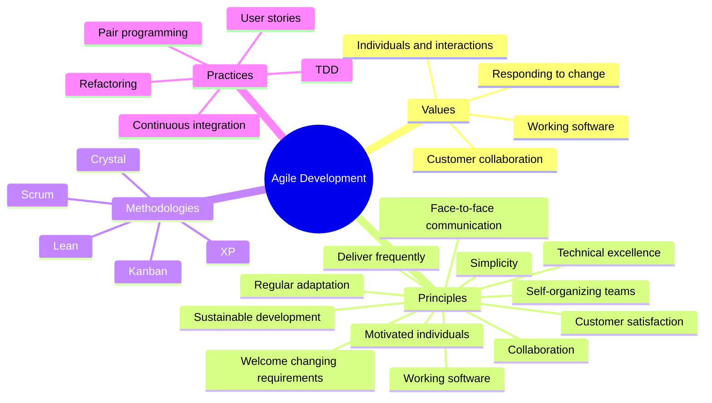
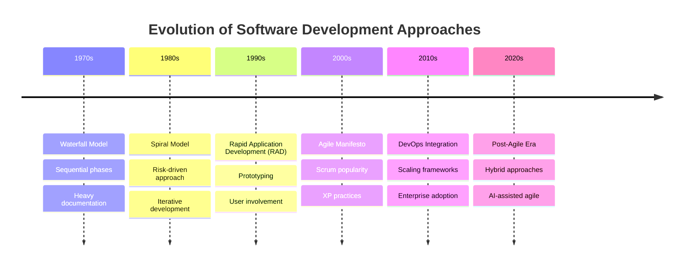
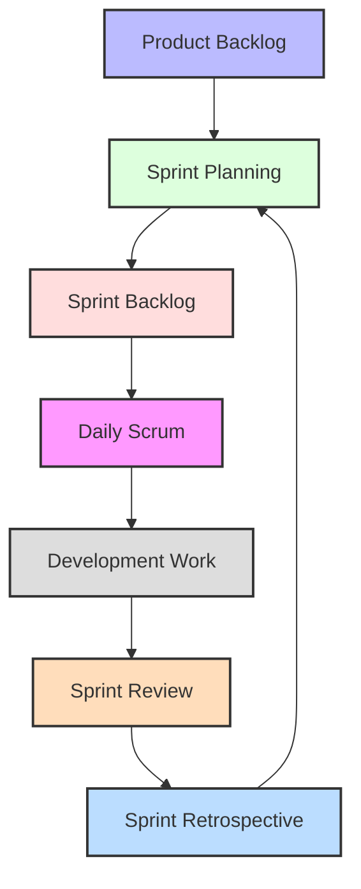
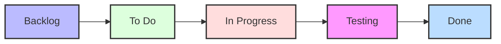
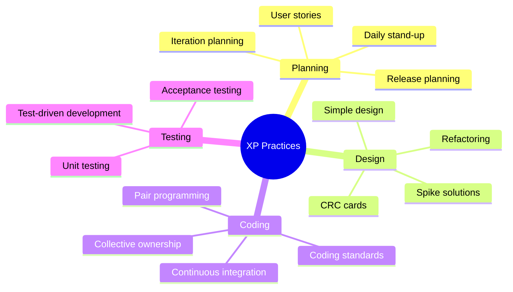
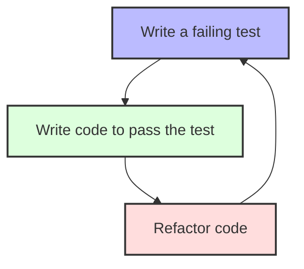

# Agile Software Development

[Back to Course Content](README.md) | [Previous: Design Concepts](design-concepts.md) | [Next: Project Management →](project-management.md)

## What is Agile Software Development?

Agile software development is an approach to software development that emphasizes iterative development, collaboration, customer feedback, and small, rapid releases. It's a response to traditional heavyweight methodologies that proved too rigid for many projects.



## Historical Context and Evolution

### From Waterfall to Agile



### The Agile Manifesto

The Agile Manifesto, created in 2001 by 17 software developers, established four core values:

1. **Individuals and interactions** over processes and tools
2. **Working software** over comprehensive documentation
3. **Customer collaboration** over contract negotiation
4. **Responding to change** over following a plan

### Twelve Principles Behind the Agile Manifesto

1. Customer satisfaction through early and continuous delivery
2. Welcome changing requirements, even late in development
3. Deliver working software frequently
4. Business people and developers must work together daily
5. Build projects around motivated individuals
6. Face-to-face conversation is the best communication
7. Working software is the primary measure of progress
8. Sustainable development pace
9. Continuous attention to technical excellence
10. Simplicity—maximizing the amount of work not done
11. Self-organizing teams generate the best architectures and designs
12. Regular reflection and adaptation

## Key Agile Methodologies

### Scrum

Scrum is the most widely used agile framework, focused on delivering complex projects through collaboration, accountability, and iterative progress.



#### Scrum Roles

| Role | Responsibilities | Real-world Example |
|------|-----------------|-------------------|
| **Product Owner** | Manages product backlog, maximizes value, stakeholder liaison | In a banking app, determines feature priorities based on customer needs |
| **Scrum Master** | Facilitates Scrum process, removes impediments, coaches team | Helps team resolve blockers with third-party API integration |
| **Development Team** | Self-organizing group that creates the product increment | Cross-functional team of developers, testers, and designers |

#### Scrum Artifacts

1. **Product Backlog**: Ordered list of everything needed in the product
2. **Sprint Backlog**: Set of Product Backlog items selected for the Sprint
3. **Increment**: Sum of all Product Backlog items completed during a Sprint

#### Scrum Events

1. **Sprint**: Timeboxed period (usually 2-4 weeks) for creating a product increment
2. **Sprint Planning**: Meeting to determine Sprint work
3. **Daily Scrum**: 15-minute synchronization meeting
4. **Sprint Review**: Demonstration of completed work
5. **Sprint Retrospective**: Team reflection on process improvement

### Kanban

Kanban is a visual workflow management method that helps teams visualize their work, limit work in progress, and maximize efficiency.



#### Kanban Principles

1. **Visualize workflow**: Making work visible helps identify bottlenecks
2. **Limit Work in Progress (WIP)**: Reduces multitasking and improves flow
3. **Manage flow**: Monitor and optimize the smooth flow of work
4. **Make process policies explicit**: Clear rules for how work progresses
5. **Implement feedback loops**: Regular review and adaptation
6. **Improve collaboratively**: Continuous improvement based on shared understanding

#### Kanban vs. Scrum

| Feature | Kanban | Scrum |
|---------|--------|-------|
| **Cadence** | Continuous flow | Fixed-length sprints |
| **Release methodology** | Continuous delivery | At the end of each sprint |
| **Roles** | No required roles | Product Owner, Scrum Master, Development Team |
| **Key metrics** | Lead time, cycle time, WIP | Velocity, burndown charts |
| **Change philosophy** | Changes can happen anytime | No changes during sprint |
| **Board usage** | Persistent board | Reset after each sprint |
| **WIP limits** | Explicitly limited | Implicitly limited by sprint backlog |

### Extreme Programming (XP)

XP focuses on technical excellence and engineering practices that enable high-quality software development.

#### Core XP Practices



### Lean Software Development

Adapted from Toyota's manufacturing principles, Lean focuses on maximizing value while minimizing waste.

#### Lean Principles in Software

1. **Eliminate waste**: Remove anything that doesn't add value
2. **Build quality in**: Prevent defects rather than fixing them
3. **Create knowledge**: Document and share learning
4. **Defer commitment**: Make decisions at the last responsible moment
5. **Deliver fast**: Minimize time from concept to customer
6. **Respect people**: Empower the team and listen to their ideas
7. **Optimize the whole**: Focus on the entire value stream

## Agile Practices and Techniques

### User Stories

User stories are short, simple descriptions of features told from the perspective of the user.

**Format**:
```
As a [role]
I want [feature]
So that [benefit]
```

**Example**:
```
As a mobile banking user
I want to receive transaction notifications in real-time
So that I can immediately detect unauthorized transactions
```

#### INVEST Criteria for Good User Stories

- **Independent**: Can be developed separately
- **Negotiable**: Details can be discussed
- **Valuable**: Provides value to users or customers
- **Estimable**: Team can estimate the size
- **Small**: Fits within a single iteration
- **Testable**: Clear criteria for completion

### Test-Driven Development (TDD)

TDD is a development process where tests are written before the code that needs to be tested.



#### Benefits of TDD

- Higher code quality and fewer defects
- Built-in regression testing
- Improved design through continuous refactoring
- Documentation through tests
- Greater confidence in code changes

**Real-World Application**: A payment processing system might use TDD to ensure that all transaction validation rules are properly implemented and maintained over time.

### Continuous Integration (CI)

CI is a practice where developers frequently integrate their code changes into a shared repository, with automated verification to detect problems early.

#### CI Process

1. Developer commits code to version control
2. CI server detects changes and triggers build
3. Code is compiled and tested automatically
4. Results are reported to the team
5. If issues are found, they are fixed immediately

**Real-World Application**: A social media platform might use CI to ensure that new features don't break existing functionality across different devices and browsers.

### Pair Programming

Pair programming involves two programmers working together at one computer, with one typing (driver) and one reviewing (navigator).

#### Benefits of Pair Programming

- Knowledge sharing and skill transfer
- Higher code quality through continuous review
- Reduced defects and technical debt
- Better design decisions through collaboration
- Faster onboarding of new team members

**Real-World Application**: Security-critical applications often use pair programming to ensure code quality and reduce vulnerabilities.

## Agile at Scale

### Scaling Frameworks

| Framework | Key Features | Best Suited For |
|-----------|-------------|----------------|
| **SAFe (Scaled Agile Framework)** | Portfolio, Program, Team levels<br>Alignment across organization | Large enterprises |
| **LeSS (Large-Scale Scrum)** | Minimal structure<br>Multiple teams, one product | Organizations up to 8 teams |
| **Nexus** | Shared integration team<br>Focus on dependencies | 3-9 Scrum teams |
| **Spotify Model** | Squads, tribes, chapters, guilds<br>Autonomy with alignment | Innovative, fast-moving companies |
| **DAD (Disciplined Agile Delivery)** | Hybrid approach<br>Context-sensitive choices | Complex environments |

### Common Challenges in Scaling Agile

1. **Coordination and dependencies**: Managing work across multiple teams
2. **Consistent practices**: Maintaining agile principles across teams
3. **Technical integration**: Ensuring components work together
4. **Organizational resistance**: Overcoming established bureaucracy
5. **Distributed teams**: Handling geographical separation

## Measuring Agile Performance

### Key Metrics

| Metric | What It Measures | How to Calculate | Target Values |
|--------|------------------|-----------------|--------------|
| **Velocity** | Team's delivery rate | Sum of story points completed per iteration | Consistent, not necessarily increasing |
| **Lead Time** | Time from idea to delivery | Time from backlog entry to production | Decreasing trend |
| **Cycle Time** | Time to complete a task | Time from work start to completion | Decreasing trend |
| **Escaped Defects** | Quality issues | Defects found after release | Approaching zero |
| **Team Happiness** | Team satisfaction | Survey results | High and stable |
| **Customer Satisfaction** | Value delivered | Customer feedback scores | Increasing trend |

### Agile Maturity Models

Agile maturity models help organizations assess and improve their agile implementation.

**Example: 5-Level Maturity Model**
1. **Initial**: Ad-hoc agile practices
2. **Exploring**: Team-level implementation
3. **Defining**: Standardized practices
4. **Scaling**: Multiple teams using agile
5. **Optimizing**: Continuous improvement

## Real-World Applications and Case Studies

### Success Stories

**Spotify**: Created a unique scaling model with squads, tribes, chapters, and guilds that allowed for autonomy while maintaining alignment.

**Amazon**: Uses agile principles to maintain a "two-pizza team" rule (teams small enough to be fed by two pizzas) for faster innovation.

**Microsoft**: Transformed from traditional waterfall to agile, resulting in faster releases and improved customer satisfaction for products like Visual Studio and Windows.

### Lessons Learned

1. **Cultural shift is crucial**: Agile requires mindset changes, not just process changes
2. **Leadership support is essential**: Top-down commitment enables bottom-up implementation
3. **Start small and expand**: Begin with pilot teams before scaling
4. **Adapt practices to context**: Tailor agile to your specific organization
5. **Continuous improvement**: Regular retrospectives and adaptation are key

## Challenges and Criticisms of Agile

### Common Pitfalls

1. **Agile theater**: Following ceremonies without embracing values
2. **Inadequate training**: Implementing without proper understanding
3. **Resistance to change**: Cultural barriers to adoption
4. **Neglecting technical practices**: Focus on process over engineering
5. **Misunderstanding agile**: Treating it as a silver bullet

### Valid Criticisms

- Not suitable for all projects (e.g., highly regulated environments)
- Can be challenging with fixed-price contracts
- May lead to documentation deficiencies if misinterpreted
- Potential for scope creep without proper management
- Team burnout from constant "sprint" mentality

## Future Trends in Agile

### Emerging Directions

1. **DevOps Integration**: Combining development and operations
2. **AI-assisted Agile**: Using AI for estimation, risk detection
3. **Remote Agile**: Distributed team practices post-pandemic
4. **Agile Outside IT**: Expansion to marketing, HR, finance
5. **Hybrid Approaches**: Combining agile with other methodologies

## Summary

Agile software development represents a fundamental shift from traditional, plan-driven approaches to adaptive, people-centered methods. Its focus on iterative development, customer collaboration, and responding to change has revolutionized how software is built.

The various methodologies—Scrum, Kanban, XP, and others—provide frameworks to implement agile values and principles in different contexts. Supporting practices like user stories, TDD, and continuous integration enable teams to deliver high-quality software consistently.

While agile has challenges, particularly at scale, its benefits have led to widespread adoption across industries. As software continues to transform every aspect of business and society, agile approaches will evolve to meet new demands while maintaining their core emphasis on delivering value through working software.

## References and Further Reading

- Beck, K. et al. (2001). *Manifesto for Agile Software Development*. agilemanifesto.org.
- Sutherland, J., & Schwaber, K. (2017). *The Scrum Guide*. scrumguides.org.
- Anderson, D. J. (2010). *Kanban: Successful Evolutionary Change for Your Technology Business*.
- Beck, K. (2000). *Extreme Programming Explained: Embrace Change*.
- Leffingwell, D. (2018). *SAFe 5.0: The World's Leading Framework for Business Agility*. 