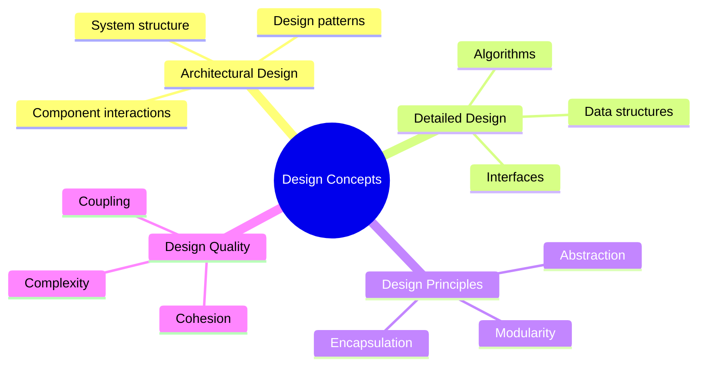
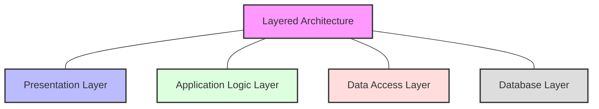
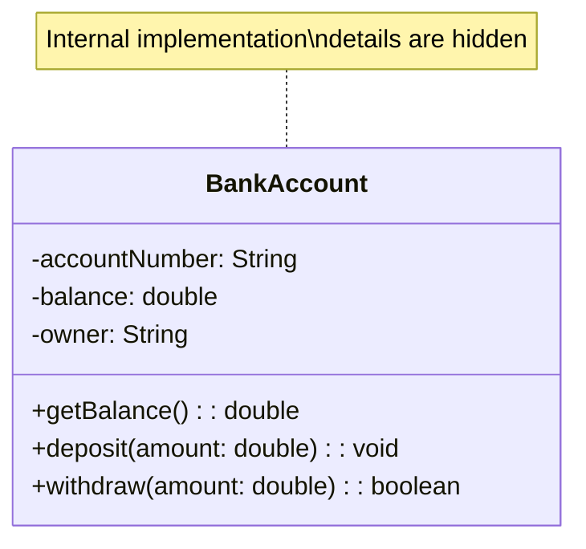
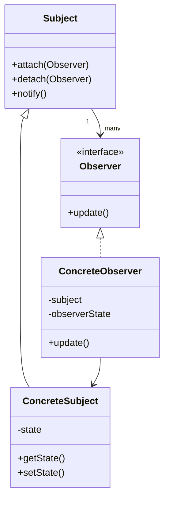
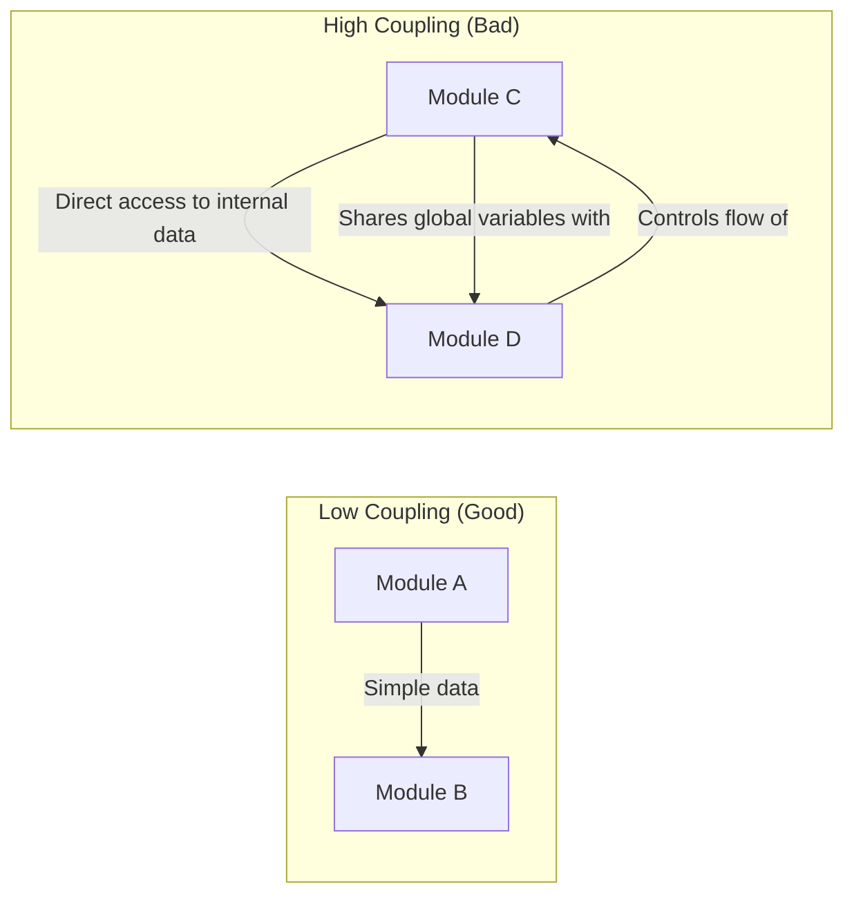
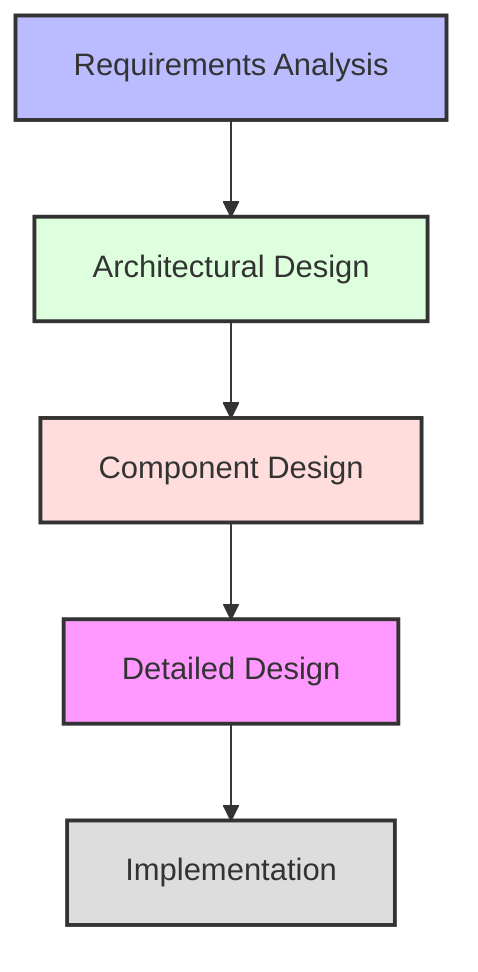

# Design Concepts in Software Engineering

[Back to Course Content](README.md) | [Previous: Requirements Engineering](requirements-engineering.md) | [Next: Agile Software Development →](agile-development.md)

> Reference: This content is based on Design Concepts.pdf

## What are Design Concepts?

Design concepts in software engineering represent the fundamental principles and approaches used to create the architecture and detailed design of software systems. They provide the theoretical foundation for creating effective, maintainable, and extensible software solutions.

## Role and Importance of Software Design

### What Design Does

- **Translates Requirements**: Transforms requirements into a blueprint for implementation
- **Establishes Structure**: Defines the organization and relationships between system components
- **Manages Complexity**: Breaks down complex systems into manageable parts
- **Ensures Quality**: Lays the foundation for maintainable, reliable software
- **Facilitates Communication**: Provides a shared understanding for the development team

### Real-World Impact

Good design significantly impacts:
- Development cost and time
- System maintainability and extensibility
- Software performance and reliability
- User experience and satisfaction
- Technical debt accumulation

## Levels of Software Design

### Architectural Design

Architectural design defines the overall structure of the system, identifying major components and their interactions.

#### Key Architectural Styles

| Style | Description | Best Used For | Real-World Examples |
|-------|-------------|--------------|-------------------|
| **Layered** | System organized into layers with specific responsibilities | Systems with clear hierarchical structure | Operating systems, network protocols |
| **Client-Server** | Distributed system with client requests and server responses | Networked applications | Web applications, email systems |
| **Microservices** | System decomposed into small, independent services | Complex, evolving applications | Netflix, Amazon, Uber |
| **Event-Driven** | Components communicate through events | Reactive systems, UIs | Trading systems, IoT applications |
| **Pipe and Filter** | Components (filters) process data streams (pipes) | Data processing applications | Unix command line, ETL systems |
| **Repository** | Central data structure with independent components | Data-centric applications | Database systems, content management |
| **Model-View-Controller** | Separates data, user interface, and control logic | Interactive applications | Web frameworks, mobile apps |

### Detailed Design

Detailed design focuses on the internal workings of individual components, specifying algorithms, data structures, and interfaces.

#### Component Design Considerations

- Internal data structures
- Algorithms and logic
- Error handling mechanisms
- Interface specifications
- Performance optimizations

## Fundamental Design Principles

### 1. Abstraction

Abstraction involves representing complex reality with simplified models, focusing on relevant aspects while hiding unnecessary details.

**Types of Abstraction:**
- **Procedural abstraction**: Hiding implementation details of a function
- **Data abstraction**: Hiding internal data structures
- **Control abstraction**: Hiding flow control mechanisms

**Real-World Application**: Database systems hide complex storage and retrieval mechanisms behind simple query interfaces.

### 2. Modularity

Modularity involves dividing a system into discrete, cohesive modules with clear responsibilities and well-defined interfaces.

**Benefits of Modularity:**
- Parallel development
- Improved maintainability
- Component reusability
- Simplified testing
- Easier evolution

**Real-World Application**: Modern web browsers are highly modular, with separate components for rendering, JavaScript execution, network communication, and extensions.

### 3. Information Hiding and Encapsulation

Information hiding involves concealing implementation details while exposing only necessary interfaces. Encapsulation bundles data and functions that operate on that data.

**Real-World Application**: In mobile operating systems, hardware access is encapsulated behind APIs, allowing applications to use device features without knowing hardware details.

### 4. Separation of Concerns

This principle involves addressing different aspects of a system independently, allowing each part to focus on a specific concern.

**Common Concerns:**
- Business logic
- User interface
- Data access
- Error handling
- Security
- Logging

**Real-World Application**: Web development frameworks separate HTML (structure), CSS (presentation), and JavaScript (behavior).

## Design Patterns

Design patterns are reusable solutions to common software design problems that occur in specific contexts.

### Types of Design Patterns

#### Creational Patterns

Patterns that deal with object creation mechanisms.

| Pattern | Description | Real-World Application |
|---------|-------------|----------------------|
| **Singleton** | Ensures a class has only one instance | Database connection pools |
| **Factory Method** | Creates objects without specifying exact class | UI element creation in frameworks |
| **Abstract Factory** | Creates families of related objects | Cross-platform UI toolkit |
| **Builder** | Separates construction from representation | Document generation systems |
| **Prototype** | Creates objects by cloning | Graphics editing software |

#### Structural Patterns

Patterns that deal with object composition and relationships.

| Pattern | Description | Real-World Application |
|---------|-------------|----------------------|
| **Adapter** | Allows incompatible interfaces to work together | Legacy system integration |
| **Bridge** | Separates abstraction from implementation | Graphics rendering systems |
| **Composite** | Composes objects into tree structures | File system hierarchies |
| **Decorator** | Adds responsibilities to objects dynamically | GUI component systems |
| **Facade** | Provides simplified interface to complex subsystem | API wrappers for complex libraries |
| **Proxy** | Represents another object | Remote service access |

#### Behavioral Patterns

Patterns that deal with object communication and responsibility assignment.

| Pattern | Description | Real-World Application |
|---------|-------------|----------------------|
| **Observer** | Notifies dependents of state changes | Event handling in UIs |
| **Strategy** | Defines family of interchangeable algorithms | Sorting algorithms in collections |
| **Command** | Encapsulates request as an object | Undo functionality in applications |
| **Iterator** | Accesses elements sequentially | Collection traversal |
| **Mediator** | Reduces direct dependencies between objects | Air traffic control systems |
| **State** | Alters object behavior when state changes | Workflow management systems |

### Pattern Example: Observer Pattern

**Real-World Example**:
In a stock market application, multiple displays (observers) receive updates whenever stock prices (subject) change.

## Design Quality Attributes

### 1. Cohesion and Coupling

#### Cohesion

Cohesion refers to how strongly related the responsibilities of a module are.

| Cohesion Type | Description | Quality |
|---------------|-------------|---------|
| **Functional** | All elements contribute to a single task | High |
| **Sequential** | Output of one element is input to another | Medium-High |
| **Communicational** | Elements operate on same data | Medium |
| **Procedural** | Elements follow a specific sequence | Medium |
| **Temporal** | Elements related by timing | Low-Medium |
| **Logical** | Elements are logically related | Low |
| **Coincidental** | Elements have no meaningful relationship | Very Low |

#### Coupling

Coupling measures the interdependence between modules.

| Coupling Type | Description | Quality |
|---------------|-------------|---------|
| **Content** | One module directly modifies another | Very Bad |
| **Common** | Modules share global data | Bad |
| **Control** | One module controls flow of another | Bad |
| **Stamp** | Modules share complex data structures | Poor |
| **Data** | Modules communicate via parameters | Good |
| **Message** | Modules communicate via function calls | Very Good |
| **No Coupling** | Modules are completely independent | Ideal |

### 2. Complexity and Simplicity

Simplicity is a key design goal. Systems should be as simple as possible but no simpler.

**Techniques for Reducing Complexity:**
- Clear abstractions
- Consistent patterns
- Well-defined interfaces
- Minimizing dependencies
- Following standards and conventions

**Real-World Application**: The Unix philosophy emphasizes small, simple programs that do one thing well.

### 3. Reusability

Reusability allows components to be used in multiple contexts, reducing development effort and improving reliability.

**Characteristics of Reusable Components:**
- Well-defined interfaces
- Good documentation
- Minimal dependencies
- Configurability/adaptability
- Robustness

**Real-World Application**: UI component libraries like React's Material-UI provide reusable interface elements.

## Design Documentation

### Design Document Components

1. **System Architecture**
   - High-level structure
   - Component relationships
   - Technology stack

2. **Detailed Design**
   - Component specifications
   - Class/module descriptions
   - Interface definitions
   - Data models

3. **Design Decisions**
   - Rationale for key decisions
   - Alternatives considered
   - Trade-offs made

4. **Non-functional Considerations**
   - Performance optimizations
   - Security mechanisms
   - Scalability approaches
   - Reliability measures

### Design Notation

Various notations are used to document design, including:
- UML diagrams
- Entity-relationship diagrams
- Data flow diagrams
- Pseudocode
- Architecture description languages

## Design Process and Methodologies

### Traditional Design Process

### Agile Design Approaches

- **Emergent Design**: Design evolves incrementally throughout development
- **Refactoring**: Continuously improving design without changing behavior
- **Test-Driven Development**: Tests drive design decisions
- **Just-in-time Design**: Design decisions made at the last responsible moment

### Design Techniques

| Technique | Description | Benefits |
|-----------|-------------|----------|
| **CRC Cards** | Class-Responsibility-Collaboration cards | Simplicity, team collaboration |
| **Design Sketching** | Informal diagrams and sketches | Quick visualization, exploration |
| **Prototyping** | Working models of interfaces or components | User feedback, risk reduction |
| **Scenario-based Design** | Design driven by user scenarios | User-centered approach |
| **Domain-Driven Design** | Focus on core domain concepts | Alignment with business needs |

## Case Studies: Design in Practice

### Case Study 1: E-commerce Platform

**Design Challenges:**
- High availability requirements
- Scalability for variable traffic
- Secure payment processing
- Integration with multiple systems

**Design Solutions:**
- Microservices architecture
- Stateless components for horizontal scaling
- Caching strategies
- Asynchronous processing for orders
- Circuit breakers for external dependencies

### Case Study 2: Medical Records System

**Design Challenges:**
- Strict privacy requirements
- High reliability needs
- Complex data relationships
- Legacy system integration

**Design Solutions:**
- Layered architecture with strict access controls
- Comprehensive audit logging
- Data isolation strategies
- Adapter pattern for legacy integration
- Redundancy for critical components

## Summary and Best Practices

### Key Design Principles to Remember

1. **Simplicity over Complexity**: Keep designs as simple as possible
2. **Anticipate Change**: Design for flexibility in areas likely to change
3. **Single Responsibility**: Each component should have one reason to change
4. **Open/Closed Principle**: Open for extension, closed for modification
5. **Component Cohesion**: Group related functionality together
6. **Loose Coupling**: Minimize dependencies between components
7. **Don't Repeat Yourself (DRY)**: Avoid duplication in code and design
8. **YAGNI (You Aren't Gonna Need It)**: Only add functionality when necessary

### Common Design Pitfalls

- Over-engineering and premature optimization
- Insufficient attention to non-functional requirements
- Ignoring existing patterns and standards
- Designing for theoretical rather than actual needs
- Poor interface design between components
- Inadequate design documentation

## Further Reading and Resources

- Gamma, E., et al. (1994). *Design Patterns: Elements of Reusable Object-Oriented Software*
- Martin, R. C. (2017). *Clean Architecture: A Craftsman's Guide to Software Structure and Design*
- Bass, L., Clements, P., & Kazman, R. (2012). *Software Architecture in Practice*
- Fowler, M. (2018). *Refactoring: Improving the Design of Existing Code*
- Evans, E. (2003). *Domain-Driven Design: Tackling Complexity in the Heart of Software* 