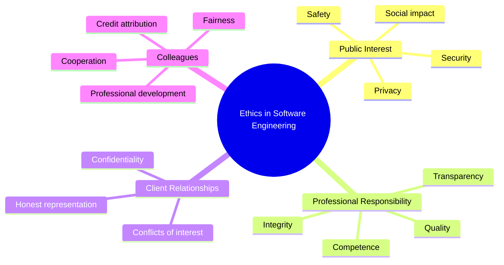

# Ethics and Professional Practice in Software Engineering

[Back to Course Content](README.md) | [← Previous: Software Quality Assurance](quality-assurance.md)

## What is Ethics in Software Engineering?

Ethics in software engineering refers to the moral principles and values that guide the behavior of software professionals. It encompasses decisions about what is right and wrong when developing, deploying, and maintaining software systems that can significantly impact individuals, organizations, and society.

### The Importance of Ethics in Software Engineering

## Professional Codes of Ethics

### ACM Code of Ethics

The Association for Computing Machinery (ACM) Code of Ethics and Professional Conduct outlines fundamental ethical principles for computing professionals.

#### General Moral Imperatives:
1. Contribute to society and human well-being
2. Avoid harm to others
3. Be honest and trustworthy
4. Be fair and take action not to discriminate
5. Respect the work required to produce new ideas, inventions, and creative works
6. Respect privacy
7. Honor confidentiality

### IEEE Code of Ethics

The Institute of Electrical and Electronics Engineers (IEEE) Code of Ethics focuses on professional responsibilities.

IEEE members commit to:
1. Hold paramount the safety, health, and welfare of the public
2. Avoid real or perceived conflicts of interest
3. Be honest and realistic in stating claims or estimates
4. Reject bribery in all its forms
5. Improve the understanding of technology and its appropriate application
6. Maintain and improve technical competence
7. Seek, accept, and offer honest criticism of technical work
8. Treat all persons fairly and with respect
9. Avoid injuring others, their property, reputation, or employment
10. Assist colleagues in their professional development

### Software Engineering Code of Ethics and Professional Practice (SEEPP)

Jointly developed by the ACM and IEEE-CS, SEEPP outlines eight principles:

1. **Public**: Act consistently with the public interest
2. **Client and Employer**: Act in a manner that is in the best interests of client and employer, consistent with the public interest
3. **Product**: Ensure products meet the highest professional standards possible
4. **Judgment**: Maintain integrity and independence in professional judgment
5. **Management**: Promote ethical approach to software development and maintenance
6. **Profession**: Advance the integrity and reputation of the profession
7. **Colleagues**: Be fair to and supportive of colleagues
8. **Self**: Participate in lifelong learning and promote ethical approach to the practice of the profession

## Ethical Issues in Software Engineering

### Privacy and Data Protection

| Issue | Description | Examples | Best Practices |
|-------|-------------|----------|----------------|
| Data Collection | Gathering personal information | Collecting location data, browsing history | Minimal collection, clear purpose |
| Data Storage | Retaining user information | Storing credit card details, health records | Encryption, secure storage, retention limits |
| Data Sharing | Transferring data to third parties | Selling user data to advertisers | Explicit consent, anonymization |
| User Consent | Obtaining permission for data use | Cookie consent, app permissions | Clear language, opt-in by default, revocable |
| Data Breaches | Unauthorized access to personal data | Credit card theft, identity information leaks | Security by design, breach notification |

### Algorithm Bias and Fairness

| Issue | Description | Real-World Example |
|-------|-------------|-------------------|
| Training Data Bias | Algorithms trained on biased historical data | Recruitment tool biased against women |
| Disparate Impact | Algorithm creates discriminatory outcomes for protected groups | Credit scoring systems favoring certain demographics |
| Lack of Diversity | Homogeneous development teams miss diverse perspectives | Facial recognition with lower accuracy for darker skin tones |
| Opacity | "Black box" algorithms with unexplainable decisions | Criminal risk assessment tools with hidden decision factors |
| Feedback Loops | Algorithms reinforcing existing biases | Predictive policing focusing disproportionately on certain neighborhoods |

### Professional Responsibility

| Responsibility | Description | Example |
|----------------|-------------|---------|
| Competence | Maintaining up-to-date knowledge and skills | Continuing education in security practices |
| Quality Work | Delivering software that meets requirements and standards | Thorough testing and documentation |
| Honesty | Being truthful about capabilities and limitations | Not overpromising features or timelines |
| Transparency | Clear communication about processes and decisions | Documenting known issues and limitations |
| Accountability | Taking responsibility for outcomes | Acknowledging and fixing mistakes promptly |

### Intellectual Property and Software Licensing

| Type | Description | Examples |
|------|-------------|----------|
| Copyright | Legal right to control copying and distribution | Source code, documentation |
| Patents | Legal right to exclude others from making, using, or selling an invention | Software algorithms, processes |
| Trademarks | Protection of names, logos, and brands | Product names, logos |
| Trade Secrets | Confidential business information | Proprietary algorithms, internal processes |
| Licensing | Terms governing software use and distribution | Open source (GPL, MIT, Apache), Proprietary licenses |

## Ethical Decision-Making Frameworks

### The Four-Step Process

1. **Identify the facts**: Gather all relevant information about the situation
2. **Identify the stakeholders and their perspectives**: Consider who will be affected
3. **Consider alternative actions**: Generate multiple possible solutions
4. **Analyze the alternatives using ethical principles**: Apply ethical theories and professional codes

### Ethical Lenses

| Ethical Theory | Key Question | Software Engineering Application |
|----------------|--------------|----------------------------------|
| Utilitarianism | What action produces the most good for the most people? | Feature prioritization based on user benefit |
| Deontology | What is the right action regardless of consequences? | Maintaining data privacy even if it limits functionality |
| Virtue Ethics | What would a virtuous person do? | Developing software with integrity and excellence |
| Social Contract | What serves the common good of society? | Creating accessible software for diverse users |
| Rights-based | What respects the rights of all involved? | Ensuring informed consent for data collection |

## Case Studies in Software Engineering Ethics

### Case Study 1: Volkswagen Emissions Scandal

**Situation**: Engineers created software to detect when vehicles were being emissions tested and temporarily reduce emissions during testing.

**Ethical Issues**:
- Deliberate deception of regulators and customers
- Environmental harm through increased pollution
- Lack of professional integrity

**Outcome**: 
- $30 billion in fines and settlements
- Criminal charges against executives
- Severe damage to company reputation

**Lessons**:
- The importance of professional integrity
- The cost of unethical decisions
- The role of organizational culture in ethical behavior

### Case Study 2: Cambridge Analytica

**Situation**: Data analytics firm harvested personal data from millions of Facebook users without consent for political advertising.

**Ethical Issues**:
- Privacy violations
- Lack of informed consent
- Manipulation of democratic processes
- Data misuse

**Outcome**:
- Facebook fined $5 billion
- Cambridge Analytica closed
- Increased scrutiny of social media platforms
- New data protection regulations

**Lessons**:
- The importance of user consent
- The power of data and algorithms
- The need for regulatory oversight

### Case Study 3: Boeing 737 MAX MCAS System

**Situation**: Software system contributed to two fatal crashes due to design flaws and inadequate disclosure to pilots.

**Ethical Issues**:
- Safety compromises
- Insufficient testing
- Inadequate documentation and training
- Prioritizing profit over safety

**Outcome**:
- 346 deaths
- Grounding of all 737 MAX aircraft
- Criminal charges and fines
- Major reputation damage

**Lessons**:
- Safety-critical software requires rigorous testing
- Transparency with users about system behavior
- The importance of professional judgment

## Ethical Considerations in Emerging Technologies

### Artificial Intelligence and Machine Learning

| Ethical Consideration | Key Questions | Guidelines |
|-----------------------|---------------|------------|
| Transparency | Are AI decisions explainable? | Use interpretable models when possible, provide explanations |
| Accountability | Who is responsible for AI decisions? | Establish clear lines of responsibility, human oversight |
| Bias | Does the AI discriminate unfairly? | Diverse training data, regular bias audits |
| Autonomy | How much control should AI systems have? | Appropriate human oversight, clear boundaries |
| Privacy | How is personal data used in AI? | Data minimization, purpose limitation |

### Internet of Things (IoT)

| Ethical Consideration | Key Questions | Guidelines |
|-----------------------|---------------|------------|
| Privacy | What data is collected and how is it used? | Minimal collection, clear disclosures |
| Security | Are devices protected from unauthorized access? | Security by design, regular updates |
| Dependency | What happens if systems fail? | Graceful degradation, offline functionality |
| Consent | Do users understand what they're agreeing to? | Clear, understandable terms |
| Obsolescence | What happens when devices are no longer supported? | Planned support lifecycles, responsible end-of-life |

### Cybersecurity Ethics

| Ethical Consideration | Key Questions | Guidelines |
|-----------------------|---------------|------------|
| Vulnerability Disclosure | How should security flaws be reported? | Responsible disclosure policies |
| Privacy vs. Security | When should security override privacy? | Proportionality, necessity, transparency |
| Offensive Security | When is it ethical to "hack back"? | Legal boundaries, proportional response |
| Access Control | Who should have access to sensitive data? | Principle of least privilege |
| Surveillance | When is monitoring users justified? | Consent, transparency, purpose limitation |

## Building an Ethical Culture in Software Organizations

### Organizational Practices

1. **Ethics Training**: Regular education on ethical principles and decision-making
2. **Code of Ethics**: Organization-specific guidelines for ethical behavior
3. **Ethics Review Boards**: Panels to evaluate ethically complex decisions
4. **Open Communication**: Channels for raising ethical concerns
5. **Ethical Leadership**: Setting the tone from the top
6. **Diversity and Inclusion**: Diverse perspectives to identify potential ethical issues

### Individual Practices

1. **Continuous Learning**: Staying informed about ethical issues and best practices
2. **Courage**: Willingness to speak up about ethical concerns
3. **Reflection**: Regular consideration of the ethical implications of work
4. **Mentorship**: Guiding others in ethical professional practice
5. **Community Engagement**: Participating in broader discussions about ethics

## Regulatory and Legal Frameworks

### Data Protection Regulations

| Regulation | Jurisdiction | Key Provisions |
|------------|--------------|----------------|
| GDPR | European Union | Consent requirements, right to be forgotten, data portability |
| CCPA/CPRA | California, USA | Consumer rights over personal data, opt-out requirements |
| HIPAA | USA (Healthcare) | Protected health information safeguards |
| LGPD | Brazil | Personal data processing requirements, data subject rights |
| POPIA | South Africa | Lawful processing conditions, cross-border transfer limitations |

### Professional Licensure and Certification

In some jurisdictions, software engineering is moving toward professional licensure:

- **Licensed Professional Engineer**: Legal designation requiring education, experience, examination, and ethics
- **Certified Software Development Professional**: Industry certification of knowledge and skills
- **Professional Engineering Ethics**: Legal and ethical obligations to protect public safety

### Whistleblower Protections

Legal protections for those who report:
- Illegal activities
- Violations of regulations
- Threats to public health or safety
- Waste, fraud, or abuse

## Social Responsibility in Software Engineering

| Area | Description | Examples |
|------|-------------|----------|
| Digital Divide | Addressing inequality in technology access | Low-resource software versions, offline functionality |
| Accessibility | Ensuring software is usable by all people | Screen reader compatibility, keyboard navigation |
| Environmental Impact | Minimizing ecological footprint | Energy-efficient algorithms, sustainable data centers |
| Community Engagement | Contributing to the broader community | Open source contributions, technology education |
| Ethical Supply Chain | Ensuring ethical sourcing and labor practices | Conflict-free materials, fair labor conditions |

## Ethics in Professional Development

### Continuing Education

- **Technical Skills**: Staying current with technologies and best practices
- **Ethical Knowledge**: Learning about emerging ethical issues
- **Soft Skills**: Developing communication and leadership capabilities
- **Domain Knowledge**: Understanding the impact of software in specific fields

### Professional Communities

- **Professional Organizations**: ACM, IEEE, local engineering societies
- **Ethics Working Groups**: Developing industry standards and guidelines
- **Open Source Communities**: Collaborating on ethical software practices
- **Conferences and Meetups**: Sharing knowledge and best practices

## Summary

Ethics and professional practice form the foundation of responsible software engineering. Key principles include:

- Prioritizing public interest and safety
- Maintaining honesty and integrity
- Respecting privacy and confidentiality
- Developing and maintaining professional competence
- Acting with fairness and without discrimination
- Taking responsibility for the consequences of one's work
- Contributing to the profession and society

By incorporating these principles into daily practice, software engineers can create systems that not only function effectively but also respect human rights, promote well-being, and contribute positively to society. 