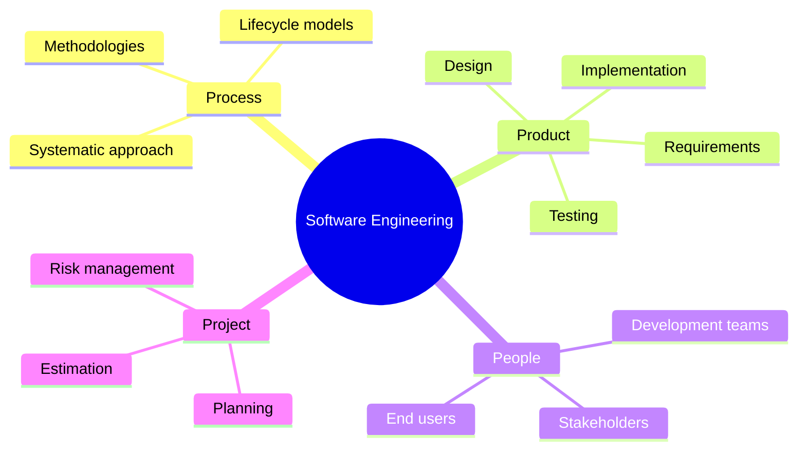
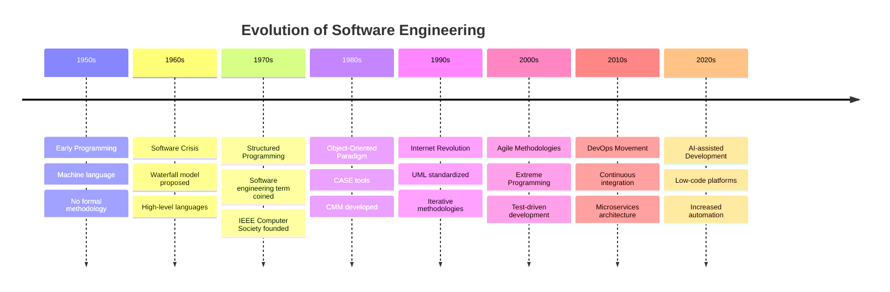
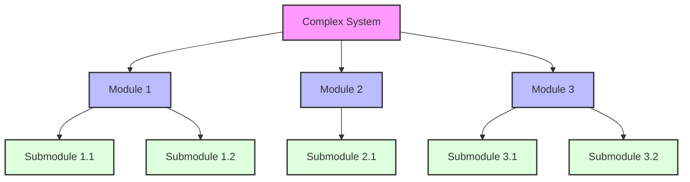
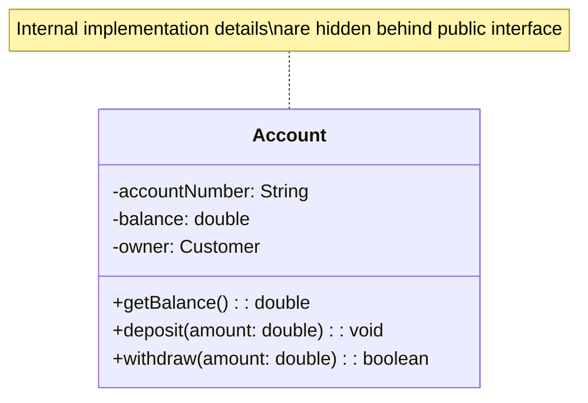
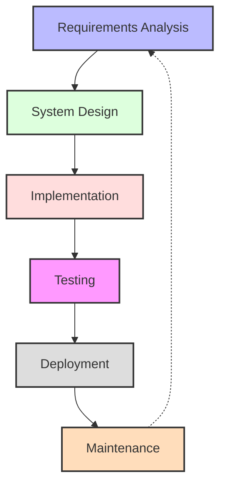
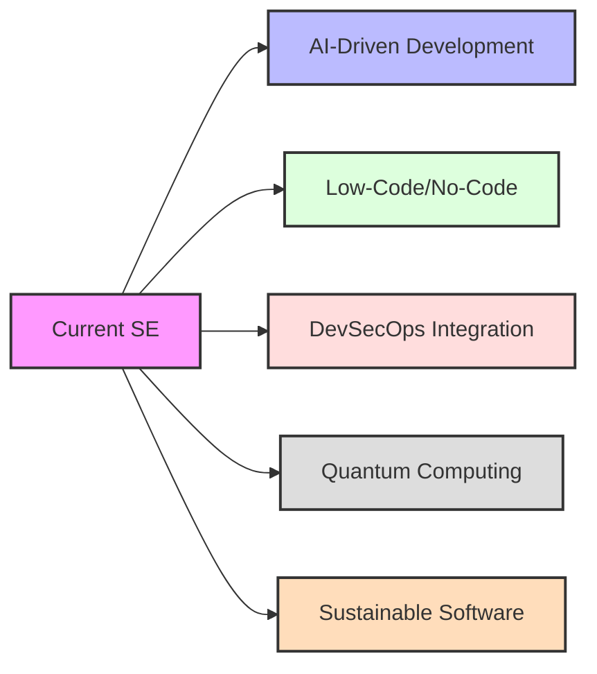

# Introduction to Software Engineering

[Back to Course Content](README.md) | [Next: System Modeling →](system-modeling.md)

> Reference: This content is based on Lecture 1 (Lecrure01-MSC.pdf)

## What is Software Engineering?

Software Engineering is the application of engineering principles to the design, development, testing, deployment, and maintenance of software. It encompasses a systematic, disciplined, and quantifiable approach to software development.

### Definition and Scope

<strong>Key Characteristics of Software Engineering</strong>

1. **Systematic Approach**
   - Organized methodology rather than ad-hoc programming
   - Well-defined processes and procedures
   - Repeatable and predictable outcomes

2. **Engineering Principles**
   - Application of scientific knowledge
   - Mathematical foundations and formal methods
   - Trade-off analysis and optimization

3. **Full Lifecycle Coverage**
   - Requirements engineering
   - Design and architecture
   - Implementation and coding
   - Testing and quality assurance
   - Deployment and maintenance

4. **Interdisciplinary Nature**
   - Computer science theories
   - Project management practices
   - Human-computer interaction
   - Domain-specific knowledge

## Software vs. Software Engineering

| Aspect | Software | Software Engineering |
|--------|----------|----------------------|
| **Focus** | Product (code, programs) | Process and methodology |
| **Scope** | Specific functionality | Entire development lifecycle |
| **Approach** | Often creative/individual | Systematic/team-oriented |
| **Duration** | Until program works | Ongoing throughout lifecycle |
| **Skills** | Programming languages | Includes design, testing, management |
| **Metric** | Functionality | Quality, maintainability, efficiency |

## Evolution of Software Engineering

<strong>The Software Crisis</strong>

In the late 1960s, the industry faced what became known as the "Software Crisis":

1. **Problems Identified**
   - Projects going over budget
   - Missing deadlines
   - Poor quality and reliability
   - Difficult maintenance
   - Customer dissatisfaction

2. **Root Causes**
   - Increasing software complexity
   - Lack of disciplined approaches
   - Poor project management
   - Inadequate requirements analysis
   - Limited tools and techniques

3. **Response**
   - NATO conferences (1968, 1969) where the term "software engineering" was coined
   - Development of structured methodologies
   - Introduction of lifecycle models
   - Emphasis on formal specifications

## Core Principles of Software Engineering

### 1. Abstraction

Abstraction involves simplifying complex systems by modeling at different levels of detail. It helps manage complexity by focusing on relevant aspects while hiding implementation details.

**Examples of Abstraction Levels:**
- **Conceptual**: Entity-relationship diagrams, class diagrams
- **Specification**: Interfaces, APIs, contracts
- **Implementation**: Actual code, algorithms, data structures

### 2. Modularity and Separation of Concerns

Modularity involves dividing a system into discrete, manageable components with clear responsibilities and minimal dependencies.

**Benefits of Modularity:**
- Improved maintainability
- Parallel development
- Reusable components
- Localized impact of changes
- Easier testing

### 3. Encapsulation and Information Hiding

Encapsulation bundles data and operations while hiding internal states and implementation details. It creates a protective barrier around components.

### 4. Software Process Models

Software process models define structured approaches to developing software, specifying activities, roles, deliverables, and workflows.

**Common Process Models:**

| Model | Characteristics | Best Suited For | Limitations |
|-------|----------------|-----------------|-------------|
| **Waterfall** | Sequential phases Each phase completed before next | Well-understood requirements Stable domains | Inflexible to changes Late feedback |
| **Iterative** | Multiple cycles of development Progressive refinement | Complex systems Risk management | Potential rework Management overhead |
| **Incremental** | System developed in increments Partial implementations | Early functionality delivery Prioritized features | Integration challenges Architecture issues |
| **Spiral** | Risk-driven approach Prototyping and evaluation | High-risk projects Complex requirements | Complex Resource-intensive |
| **Agile** | Adaptive planning Evolutionary development | Changing requirements Customer collaboration | Less documentation Scaling challenges |

## Software Development Life Cycle (SDLC)

<strong>SDLC Phases in Detail</strong>

1. **Requirements Analysis**
   - Gather stakeholder needs
   - Define functional and non-functional requirements
   - Create requirement specifications
   - Techniques: interviews, questionnaires, observation, use cases

2. **System Design**
   - Architectural design
   - Detailed design
   - Interface design
   - Data design
   - Artifacts: design documents, UML diagrams, prototypes

3. **Implementation**
   - Coding based on design documents
   - Unit testing
   - Code reviews
   - Continuous integration
   - Artifacts: source code, documentation, build scripts

4. **Testing**
   - Integration testing
   - System testing
   - Acceptance testing
   - Performance testing
   - Artifacts: test plans, test cases, bug reports

5. **Deployment**
   - Installation
   - Configuration
   - Training
   - Data migration
   - Artifacts: deployment plan, user manuals, training materials

6. **Maintenance**
   - Bug fixes
   - Feature enhancements
   - Performance improvements
   - Adaptation to changing environment
   - Artifacts: change requests, updated documentation

## Real-World Applications

### 1. Banking Systems

Banking systems require robust software engineering practices due to their complexity, security requirements, and mission-critical nature.

**Software Engineering Aspects:**
- **Reliability**: Ensuring transaction integrity and system availability
- **Security**: Implementing multiple security layers and encryption
- **Scalability**: Handling millions of transactions daily
- **Compliance**: Meeting regulatory requirements and standards
- **Integration**: Connecting with various external systems and services

### 2. Healthcare Information Systems

**Software Engineering Challenges:**
- Interoperability between different systems
- Privacy and security (HIPAA compliance)
- Complex workflows and user roles
- Data integrity and availability
- User-friendly interfaces for diverse users

### 3. Aerospace and Defense

**Critical Software Engineering Practices:**
- Formal verification methods
- Rigorous testing and simulation
- Redundancy and fault tolerance
- Configuration management
- Safety-critical development standards (DO-178C)

### 4. E-commerce Platforms

**Key Engineering Considerations:**
- Highly scalable architecture
- Performance optimization
- Security for payment processing
- User experience and accessibility
- Analytics and data-driven improvements

## Software Engineering Metrics

Software engineering metrics are quantitative measures used to evaluate software quality, development processes, and project progress.

### Product Metrics

| Metric | Description | Formula/Measurement |
|--------|-------------|---------------------|
| **Code Complexity** | Measures complexity of code | Cyclomatic complexity = E - N + 2P (E=edges, N=nodes, P=connected components) |
| **Defect Density** | Number of defects per unit size | Defects / KLOC (thousand lines of code) |
| **Maintainability Index** | Ease of maintenance | MI = 171 - 5.2ln(HV) - 0.23CC - 16.2ln(LOC) (HV=Halstead Volume, CC=Cyclomatic Complexity) |
| **Test Coverage** | Code covered by tests | (Tested Code / Total Code) × 100% |
| **Response Time** | System response to user actions | Measured in milliseconds |

### Process Metrics

| Metric | Description | Example |
|--------|-------------|---------|
| **Velocity** | Work completed per iteration | 30 story points per sprint |
| **Lead Time** | Time from request to delivery | 45 days from requirement to production |
| **Defect Resolution Time** | Time to fix defects | Average 3 days to resolve critical bugs |
| **Requirements Stability** | Change in requirements | 15% requirements changed after baseline |
| **Sprint Burndown** | Work remaining in sprint | Daily tracking of remaining effort |

## Industry Standards and Best Practices

### Key Standards Organizations

1. **IEEE** (Institute of Electrical and Electronics Engineers)
   - IEEE 830: Software Requirements Specification
   - IEEE 1016: Software Design Description
   - IEEE 12207: Software Life Cycle Processes

2. **ISO/IEC** (International Organization for Standardization)
   - ISO/IEC 9126: Software Quality Characteristics
   - ISO/IEC 25010: Systems and Software Quality Requirements and Evaluation
   - ISO/IEC 15504: Process Assessment (SPICE)

3. **CMMI** (Capability Maturity Model Integration)
   - Level 1: Initial (ad hoc processes)
   - Level 2: Managed (projects are planned and controlled)
   - Level 3: Defined (standard processes across organization)
   - Level 4: Quantitatively Managed (processes measured and controlled)
   - Level 5: Optimizing (continuous process improvement)

### Industry Best Practices

1. **Version Control**
   - Git, Subversion, Mercurial
   - Branching strategies
   - Pull/merge request reviews

2. **Continuous Integration/Continuous Deployment (CI/CD)**
   - Automated builds
   - Automated testing
   - Deployment pipelines

3. **Code Reviews**
   - Peer review process
   - Static code analysis
   - Coding standards enforcement

4. **Documentation**
   - Code documentation
   - API documentation
   - User manuals
   - Architecture documentation

## Challenges in Software Engineering

1. **Complexity Management**
   - Ever-increasing system complexity
   - Integration of diverse technologies
   - Legacy system maintenance

2. **Changing Requirements**
   - Evolving user needs
   - Market dynamics
   - Technological advancements

3. **Time and Resource Constraints**
   - Budget limitations
   - Tight schedules
   - Resource availability

4. **Quality vs. Time-to-Market**
   - Balancing thorough testing with rapid deployment
   - Technical debt management
   - Feature prioritization

5. **Security Concerns**
   - Growing security threats
   - Privacy regulations
   - Secure coding practices

## Future Trends

1. **AI-Driven Development**
   - Automated code generation and optimization
   - Intelligent debugging and testing
   - Predictive analytics for project management

2. **Low-Code/No-Code Platforms**
   - Democratization of development
   - Visual programming interfaces
   - Integration with traditional development

3. **DevSecOps Integration**
   - Security as part of development pipeline
   - Automated vulnerability scanning
   - Compliance as code

4. **Quantum Computing Preparation**
   - Quantum-resistant algorithms
   - Quantum software development kits
   - New programming paradigms

5. **Sustainable Software Engineering**
   - Energy-efficient algorithms
   - Carbon-aware computing
   - Environmentally sustainable practices

## Related Topics
- [System Modeling](system-modeling.md) - Representing software systems
- [Requirements Engineering](requirements-engineering.md) - Gathering and analyzing requirements
- [Design Concepts](design-concepts.md) - Principles of software design
- [Agile Development](agile-development.md) - Flexible development methodologies

---
[Back to Course Content](README.md) | [Next: System Modeling →](system-modeling.md) 