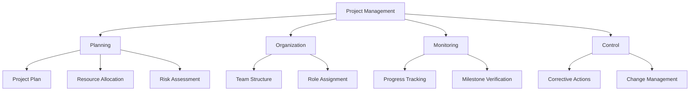

# Project Management in Software Engineering

[Back to Course Content](README.md) | [← Previous: Agile Development](agile-development.md) | [Next: Software Quality Assurance →](quality-assurance.md)

## What is Software Project Management?

Software Project Management is the art and science of planning and leading software projects. It involves the application of knowledge, skills, tools, and techniques to meet project requirements and achieve stakeholder satisfaction within constraints of scope, time, quality, and budget.

### Core Components of Software Project Management



## Responsibilities of a Software Project Manager

| Responsibility | Description | Examples |
|----------------|-------------|----------|
| Project Planning | Develop comprehensive project plans | Work breakdown structure, Gantt charts, network diagrams |
| Team Management | Build and lead effective development teams | Team formation, conflict resolution, motivation |
| Resource Allocation | Assign resources optimally | Budget management, personnel allocation, equipment procurement |
| Risk Management | Identify, assess, and mitigate risks | Risk registers, contingency plans, mitigation strategies |
| Communication | Facilitate information exchange | Status meetings, reports, stakeholder engagement |
| Quality Management | Ensure deliverables meet quality standards | Quality assurance, verification, validation |
| Change Management | Control and implement changes | Change request process, impact analysis, approval workflows |

## Project Planning Techniques

### Work Breakdown Structure (WBS)

A hierarchical decomposition of the total scope of work to be carried out by the project team.

```
Project
├── Phase 1: Requirements
│   ├── Task 1.1: Stakeholder interviews
│   ├── Task 1.2: Requirements documentation
│   └── Task 1.3: Requirements validation
├── Phase 2: Design
│   ├── Task 2.1: Architecture design
│   └── Task 2.2: Interface design
└── Phase 3: Implementation
    ├── Task 3.1: Component development
    └── Task 3.2: Integration
```

### Critical Path Method (CPM)

A technique used to predict project duration by analyzing which sequence of activities has the least amount of scheduling flexibility.

The critical path formula:
- EF (Early Finish) = ES (Early Start) + Duration
- LF (Late Finish) = LS (Late Start) + Duration
- Float = LS - ES or LF - EF

### Gantt Chart

A visual representation of a project schedule showing the start and finish dates of project elements.

## Estimation Techniques

### Function Point Analysis

Function Point Analysis measures the size of software based on the functionality provided to users.

Steps:
1. Identify and categorize function types (inputs, outputs, inquiries, files, interfaces)
2. Determine complexity (low, average, high) for each function
3. Assign weights to each function based on complexity
4. Calculate unadjusted function points (UFP)
5. Apply technical complexity factors
6. Calculate final function point count

### COCOMO Model (Constructive Cost Model)

COCOMO estimates effort, cost, and schedule for software projects:

Basic COCOMO equation:
- Effort = a × (KLOC)^b person-months
- Duration = c × (Effort)^d months

Where:
- KLOC = thousands of lines of code
- a, b, c, d are constants that vary by project complexity

### Agile Estimation

- Story Points: Relative estimation units based on effort, complexity, and uncertainty
- Planning Poker: Collaborative estimation technique where team members estimate using cards
- T-shirt Sizing: Using sizes (XS, S, M, L, XL) to estimate task complexity

## Risk Management

Risk Management is the systematic process of identifying, analyzing, and responding to project risks.

### Risk Management Process

1. **Risk Identification**
   - Brainstorming
   - Historical review
   - Checklists
   - Assumption analysis
   - SWOT analysis

2. **Risk Analysis**
   - Qualitative: Probability-Impact Matrix
   - Quantitative: Expected Monetary Value (EMV), Decision Tree Analysis

3. **Risk Response Planning**
   - Avoid: Eliminate the threat
   - Transfer: Shift impact to third party
   - Mitigate: Reduce probability or impact
   - Accept: Live with the consequences

4. **Risk Monitoring and Control**
   - Regular risk reviews
   - Trigger identification
   - Response evaluation

### Risk Probability and Impact Matrix

| Probability/Impact | Low Impact | Medium Impact | High Impact |
|-------------------|------------|---------------|-------------|
| High Probability | Medium Risk | High Risk | High Risk |
| Medium Probability | Low Risk | Medium Risk | High Risk |
| Low Probability | Low Risk | Low Risk | Medium Risk |

## Team Management

### Team Structures

1. **Chief Programmer Team**
   - Hierarchical structure
   - Led by experienced programmer
   - Clear roles and responsibilities

2. **Democratic Team**
   - Decisions made collectively
   - Shared responsibility
   - Flat structure

3. **Scrum Team**
   - Self-organizing
   - Cross-functional
   - Specific roles: Scrum Master, Product Owner, Development Team

### Stages of Team Development (Tuckman Model)

1. **Forming**: Team members meet and learn about the project and their roles
2. **Storming**: Conflicts arise as team members express different opinions
3. **Norming**: Team establishes rules and develops trust
4. **Performing**: Team functions effectively as a unit
5. **Adjourning**: Project concludes and team dissolves

## Project Monitoring and Control

### Key Performance Indicators (KPIs)

| KPI | Description | Formula |
|-----|-------------|---------|
| Schedule Variance (SV) | Difference between planned and actual progress | SV = EV - PV |
| Cost Variance (CV) | Difference between budgeted and actual cost | CV = EV - AC |
| Schedule Performance Index (SPI) | Efficiency of time utilization | SPI = EV/PV |
| Cost Performance Index (CPI) | Efficiency of cost utilization | CPI = EV/AC |

Where:
- PV = Planned Value
- EV = Earned Value
- AC = Actual Cost

### Earned Value Management (EVM)

EVM is a project management technique that objectively measures project performance against schedule and cost baselines.

Key formulas:
- Estimate at Completion (EAC) = BAC/CPI
- Estimate to Complete (ETC) = EAC - AC
- Variance at Completion (VAC) = BAC - EAC

Where BAC = Budget at Completion

## Project Management Tools

| Tool Category | Examples | Primary Uses |
|---------------|----------|-------------|
| Planning Tools | Microsoft Project, GanttPRO | Schedule creation, resource allocation |
| Collaboration Tools | Slack, Microsoft Teams | Team communication, file sharing |
| Issue Tracking | Jira, Trello | Task assignment, bug tracking |
| Version Control | Git, SVN | Source code management |
| Documentation | Confluence, SharePoint | Knowledge management |
| Continuous Integration | Jenkins, Travis CI | Automated build and test |

## Real-World Applications

### Case Study: Large Enterprise Software Development

A multinational corporation developed a new ERP system:
- 18-month timeline
- $2.5M budget
- 25-person team across 3 locations

**Challenges:**
- Shifting requirements
- Integration with legacy systems
- Cross-cultural communication

**Solutions:**
- Implemented phased delivery approach
- Established change control board
- Used regular video conferences and clearly defined communication protocols
- Employed risk mitigation strategies

**Results:**
- Completed within 20 months (2 months late)
- Final budget: $2.7M (8% over)
- Successful deployment with minor post-release issues

### Case Study: Startup Mobile App Development

A startup developing a social media application:
- 4-month timeline
- $200K budget
- 6-person team

**Challenges:**
- Limited resources
- Aggressive timeline
- Evolving market conditions

**Solutions:**
- Adopted Agile Scrum methodology
- Prioritized features using MoSCoW method
- Used cloud-based infrastructure to reduce costs
- Implemented continuous user feedback loops

**Results:**
- Released MVP in 3 months
- Stayed within budget
- Positive user reception with 50,000 downloads in first month

## Ethical Considerations in Project Management

- **Transparency**: Honest reporting of project status
- **Resource Allocation**: Fair distribution of work and recognition
- **Conflict Resolution**: Unbiased approach to team conflicts
- **Stakeholder Management**: Balancing competing interests ethically
- **Sustainable Practices**: Considering environmental and social impacts

## Summary

Effective software project management requires a balance of technical knowledge, leadership skills, and methodological rigor. Successful software project managers must:

- Plan meticulously but remain adaptable
- Communicate clearly and consistently
- Manage risks proactively
- Build and nurture effective teams
- Track progress objectively
- Make data-driven decisions
- Balance competing constraints
- Continuously learn and improve

By applying these principles, organizations can increase the probability of delivering successful software projects that meet stakeholder expectations within defined constraints. 