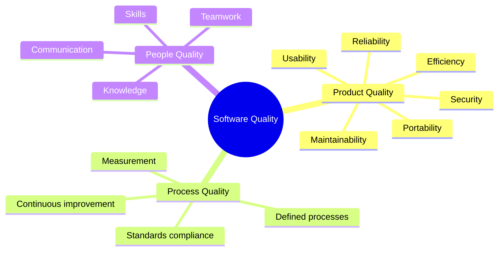
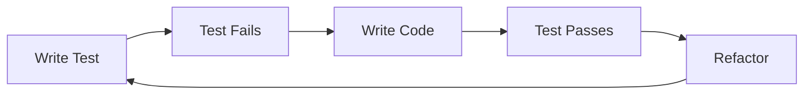
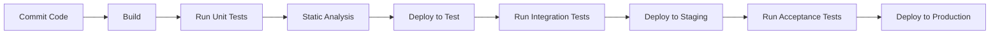
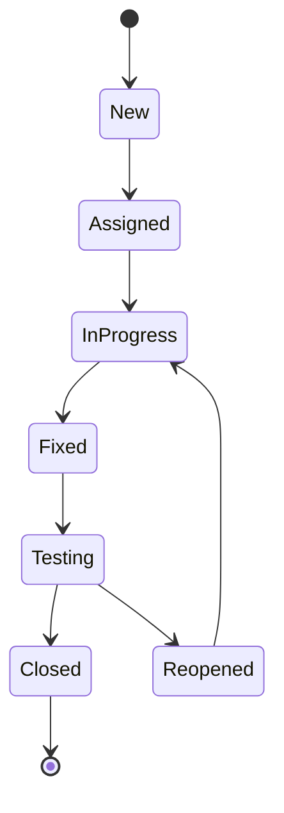

# Software Quality Assurance

[Back to Course Content](README.md) | [← Previous: Project Management](project-management.md) | [Next: Ethics and Professional Practice →](ethics.md)

## What is Software Quality Assurance?

Software Quality Assurance (SQA) is a systematic, planned approach to evaluating the quality of software products throughout the development lifecycle. It encompasses the processes, methods, and tools used to ensure that software meets or exceeds specified requirements and expectations.

### Key Dimensions of Software Quality



## Quality Attributes and Metrics

### ISO/IEC 25010 Quality Model

| Quality Attribute | Definition | Metrics |
|-------------------|------------|---------|
| Functional Suitability | Degree to which software provides functions that meet stated and implied needs | Function coverage, functional correctness, functional appropriateness |
| Performance Efficiency | Performance relative to resources used | Response time, resource utilization, capacity |
| Compatibility | Ability to exchange information with other systems | Co-existence, interoperability |
| Usability | Degree to which software can be used with effectiveness, efficiency, and satisfaction | Learnability, operability, user error protection, accessibility |
| Reliability | Ability to perform specified functions under stated conditions for a specified period | Maturity, availability, fault tolerance, recoverability |
| Security | Protection of information and data | Confidentiality, integrity, non-repudiation, accountability, authenticity |
| Maintainability | Degree of effectiveness and efficiency in modification | Modularity, reusability, analyzability, modifiability, testability |
| Portability | Ability to be transferred from one environment to another | Adaptability, installability, replaceability |

### Common Quality Metrics

| Category | Metric | Formula/Measurement |
|----------|--------|---------------------|
| Reliability | Mean Time Between Failures (MTBF) | MTBF = Total operational time / Number of failures |
| Reliability | Mean Time To Repair (MTTR) | MTTR = Total repair time / Number of repairs |
| Complexity | Cyclomatic Complexity | M = E - N + 2P (E = edges, N = nodes, P = connected components) |
| Maintainability | Maintainability Index | MI = 171 - 5.2 × ln(HV) - 0.23 × CC - 16.2 × ln(LOC) |
| Code Quality | Defect Density | Defects / KLOC (thousands of lines of code) |
| Coverage | Statement Coverage | (Executed statements / Total statements) × 100% |
| Coverage | Branch Coverage | (Executed branches / Total branches) × 100% |
| Performance | Response Time | Time between request and complete response |
| Security | Vulnerability Density | Number of vulnerabilities / KLOC |

## Quality Assurance Activities

### 1. Quality Planning

The process of developing a quality plan that outlines the specific quality practices, resources, and activities relevant to a specific project.

**Key Components of a Quality Plan:**
- Quality objectives
- Roles and responsibilities
- Quality assurance activities
- Tools and techniques
- Standards and guidelines
- Review and audit procedures
- Defect management process

### 2. Quality Control

The process of monitoring specific project results to determine if they comply with relevant quality standards and identifying ways to eliminate causes of unsatisfactory performance.

**Types of Quality Control Activities:**
- **Reviews**: Systematic examination of artifacts by peers
- **Inspections**: Formal evaluation technique where software artifacts are examined to detect defects
- **Walkthroughs**: Informal meetings where developers guide the team through code or documentation
- **Testing**: Execution of software to detect defects

### 3. Process Improvement

The ongoing effort to analyze and improve processes, services, products, and systems to meet or exceed customer expectations.

**Common Process Improvement Models:**
- **CMMI (Capability Maturity Model Integration)**
  - Five maturity levels: Initial, Managed, Defined, Quantitatively Managed, Optimizing
- **ISO 9001**
  - International standard for quality management systems
- **Six Sigma**
  - Data-driven approach to eliminate defects and reduce variation
- **PDCA (Plan-Do-Check-Act)**
  - Iterative four-step management method for continuous improvement

## Software Testing

### Testing Levels

| Level | Focus | Examples |
|-------|-------|----------|
| Unit Testing | Individual components or functions | Testing a single method or class |
| Integration Testing | Interactions between integrated components | Testing API calls between modules |
| System Testing | Complete, integrated system | End-to-end testing of entire application |
| Acceptance Testing | User requirements and business processes | User acceptance testing (UAT) |

### Testing Approaches

#### Black Box Testing
- Tests the functionality without looking at the internal code structure
- Focuses on inputs and expected outputs
- Types: Equivalence partitioning, boundary value analysis, decision table testing, state transition testing

#### White Box Testing
- Tests the internal structure or workings of an application
- Requires programming knowledge
- Types: Statement coverage, branch coverage, path coverage

#### Gray Box Testing
- Combines elements of both black box and white box testing
- Limited knowledge of internal workings
- Examples: Matrix testing, regression testing, pattern testing

### Test-Driven Development (TDD)

An iterative development process where tests are written before the code:

1. Write a failing test that defines expected functionality
2. Write minimal code to pass the test
3. Refactor the code while ensuring tests still pass



### Behavior-Driven Development (BDD)

An extension of TDD that focuses on describing behavior in a natural language format:

```gherkin
Feature: User login
  Scenario: Successful login
    Given I am on the login page
    When I enter valid credentials
    And I click the login button
    Then I should be redirected to the dashboard
```

## Verification and Validation

### Verification
Ensuring the product is built correctly (conformance to specifications)

**Questions addressed:**
- Are we building the product right?
- Does the software conform to its specifications?

**Techniques:**
- Reviews
- Inspections
- Walkthroughs
- Static analysis

### Validation
Ensuring the right product is built (fitness for purpose)

**Questions addressed:**
- Are we building the right product?
- Does the software meet user needs and expectations?

**Techniques:**
- Functional testing
- User acceptance testing
- Beta testing
- Usability testing

## Static Analysis

The examination of code without executing it, to find potential defects, vulnerabilities, and code smells.

### Static Analysis Techniques

| Technique | Description | Tools |
|-----------|-------------|-------|
| Linting | Identifying programming errors, bugs, stylistic errors | ESLint, Pylint, RuboCop |
| Code smell detection | Identifying poor design choices | SonarQube, PMD |
| Complexity analysis | Measuring code complexity | CodeClimate, NDepend |
| Security vulnerability scanning | Identifying security issues | Fortify, Checkmarx |
| Type checking | Verifying type consistency | TypeScript, MyPy |

## Test Automation

### Test Automation Pyramid

```
    /\
   /  \
  /    \
 / UI   \
/--------\
/ Service \
/----------\
/   Unit    \
/------------\
```

- **Unit Tests**: Fast, stable, focused tests at the method/class level
- **Service/API Tests**: Testing integration points and APIs
- **UI Tests**: End-to-end tests through the user interface

### Test Automation Frameworks

| Type | Examples | Best For |
|------|----------|----------|
| Unit Testing | JUnit, NUnit, pytest | Testing individual components |
| Behavior-Driven | Cucumber, SpecFlow, Behave | Collaborative specifications |
| UI Testing | Selenium, Cypress, Playwright | Testing through user interface |
| API Testing | Postman, REST Assured, Karate | Testing web services |
| Performance Testing | JMeter, Gatling, k6 | Load and stress testing |
| Mobile Testing | Appium, Espresso, XCTest | Testing mobile applications |

## Continuous Integration and Continuous Delivery (CI/CD)

### CI/CD Pipeline



### CI/CD Benefits for Quality

- Early detection of issues
- Consistent build and deployment process
- Reduced integration problems
- Automated testing
- Faster feedback loops
- Improved software quality

## Code Reviews

### Types of Code Reviews

1. **Formal Code Inspections**
   - Structured, roles-based approach
   - Preparation, meeting, rework, follow-up

2. **Peer Reviews**
   - Less formal
   - One or more reviewers examine code

3. **Pair Programming**
   - Real-time code review
   - Two developers work together

4. **Pull Request Reviews**
   - Review code before merging to main branch
   - Comments, suggestions, approvals

### Code Review Checklist

- **Functionality**: Does the code work as expected?
- **Design**: Is the code well-designed and appropriate?
- **Complexity**: Could the code be made simpler?
- **Tests**: Are there appropriate tests?
- **Naming**: Are variables, classes, and methods named clearly?
- **Comments**: Are comments clear and useful?
- **Style**: Does the code follow style guidelines?
- **Documentation**: Is documentation updated?
- **Error Handling**: Are errors handled gracefully?
- **Security**: Are there any security issues?

## Defect Management

### Defect Lifecycle



### Defect Classification

| Severity | Description | Example |
|----------|-------------|---------|
| Critical | System crash, data corruption | Database corruption, security breach |
| Major | Major feature not working | Checkout process fails |
| Moderate | Feature works with limitations | Slow performance under load |
| Minor | Cosmetic issues | Alignment problems, typos |

### Defect Analysis Techniques

1. **Root Cause Analysis (RCA)**
   - Identifying the underlying cause of defects
   - Techniques: 5 Whys, Fishbone diagram, Pareto analysis

2. **Defect Clustering**
   - Identifying modules with high defect concentration
   - Pareto principle: 80% of defects come from 20% of modules

3. **Trend Analysis**
   - Analyzing defect trends over time
   - Metrics: defect density, defect removal efficiency

## Real-World Applications

### Case Study: Banking System

A large financial institution implemented comprehensive QA for their core banking system:

**Challenge**: Ensuring zero defects in financial transactions while maintaining compliance with regulatory requirements

**Solution**:
- Implemented multi-level testing strategy
- Automated regression testing suite with 10,000+ test cases
- Formal code reviews with security specialists
- Compliance verification against financial regulations
- Performance testing with simulated peak loads

**Results**:
- Reduced post-release defects by 92%
- Zero critical issues in production
- Passed regulatory audits with no findings
- Improved customer satisfaction through increased system reliability

### Case Study: Mobile Application

A social media company developing a new feature for their mobile app:

**Challenge**: Ensuring consistent user experience across multiple platforms and devices

**Solution**:
- Implemented cross-platform automated testing
- Device farm testing on 50+ real devices
- A/B testing with limited user groups
- Crowdsourced beta testing program
- Analytics-driven quality metrics

**Results**:
- Successfully launched on iOS and Android simultaneously
- 99.7% crash-free sessions
- 25% increase in user engagement
- Reduced time-to-market by 6 weeks

## Summary

Effective Software Quality Assurance is essential for delivering reliable, maintainable, and secure software. Key principles include:

- Quality must be built in, not tested in
- Early detection of defects saves time and resources
- Automation is crucial for consistent quality verification
- Both process and product quality matter
- Continuous improvement driven by metrics and feedback
- Balance between quality and other constraints (time, cost)

By implementing comprehensive QA practices throughout the software development lifecycle, organizations can significantly reduce defects, improve user satisfaction, and reduce the total cost of ownership. 