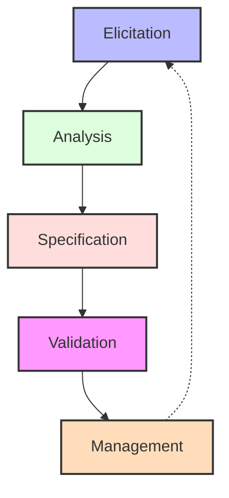
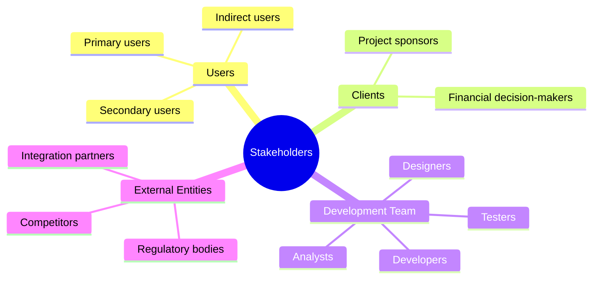
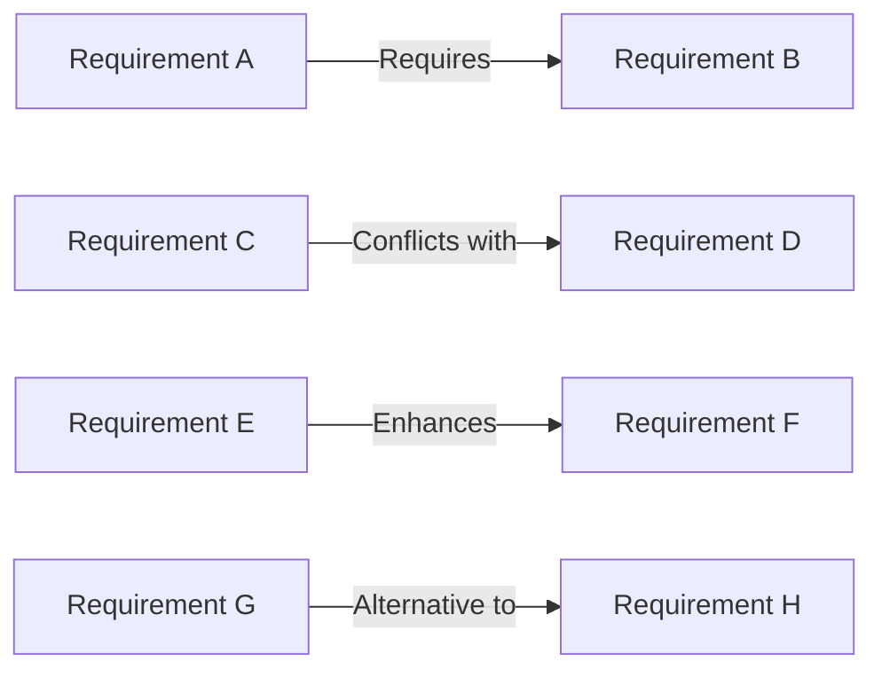
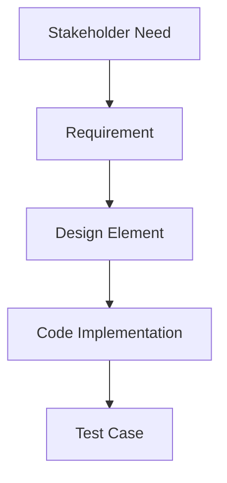
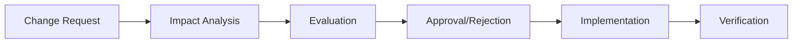

# Requirements Engineering

[Back to Course Content](README.md) | [Previous: System Modeling](system-modeling.md) | [Next: Design Concepts →](design-concepts.md)

> Reference: This content is based on SE Lec 4 - RE.pdf

## What is Requirements Engineering?

Requirements Engineering (RE) is the process of defining, documenting, and maintaining the requirements for a software system. It involves systematic handling of requirements through an iterative process of eliciting, analyzing, documenting, validating, and managing requirements.



## Why Requirements Engineering Matters

- **Foundation for Development**: Requirements serve as the foundation for all subsequent development activities
- **Cost of Errors**: Fixing requirements errors becomes exponentially more expensive in later stages
- **Stakeholder Alignment**: Ensures the system meets stakeholder expectations
- **Scope Management**: Helps control project scope and prevent feature creep
- **Quality Assurance**: Provides a baseline for validation and verification

## Types of Requirements

### Functional Requirements

Functional requirements describe what the system should do - the services, tasks, and functions the system must perform.

**Examples**:
- The system shall allow users to register with email and password
- The system shall send email notifications when an order is placed
- The system shall validate credit card information before processing payment

### Non-Functional Requirements

Non-functional requirements specify criteria for judging the operation of a system, rather than specific behaviors.

#### Categories of Non-Functional Requirements

| Category | Description | Example |
|----------|-------------|---------|
| **Performance** | Speed, response time, throughput | The system shall respond to user queries within 2 seconds |
| **Reliability** | Availability, fault tolerance, recovery | The system shall be available 99.9% of the time |
| **Usability** | User interface, accessibility | The system shall be accessible to visually impaired users |
| **Security** | Authentication, authorization, data integrity | The system shall encrypt all stored passwords |
| **Maintainability** | Ease of modification, extensibility | The system shall follow a modular architecture |
| **Scalability** | Ability to handle growth | The system shall support up to 10,000 concurrent users |
| **Compatibility** | Integration with other systems | The system shall be compatible with major web browsers |
| **Regulatory** | Compliance with laws and standards | The system shall comply with GDPR requirements |

### User Requirements

User requirements express the needs and constraints of the system from the user's perspective, often in natural language or using simple diagrams.

**Example**:
"As a customer, I want to be able to track my order so that I know when to expect delivery."

### System Requirements

System requirements provide detailed technical descriptions of what the system must do to satisfy user requirements.

**Example**:
"The order tracking subsystem shall update order status every 15 minutes and notify customers via their preferred communication channel when status changes."

## Requirements Engineering Process

### 1. Requirements Elicitation

Requirements elicitation is the process of gathering requirements from stakeholders and other sources.

#### Elicitation Techniques

| Technique | Description | Best Used When |
|-----------|-------------|---------------|
| **Interviews** | One-on-one discussions with stakeholders | Detailed information is needed from key stakeholders |
| **Questionnaires** | Structured sets of questions | Large number of stakeholders are geographically dispersed |
| **Workshops** | Collaborative sessions with multiple stakeholders | Consensus among stakeholders is needed |
| **Observation** | Watching users perform tasks | Current processes need to be understood |
| **Prototyping** | Creating system models for feedback | Requirements are unclear or feedback is needed |
| **Document Analysis** | Examining existing documentation | Replacing or enhancing existing systems |
| **Use Cases** | Describing interactions between users and system | Understanding system functionality from user perspective |
| **User Stories** | Short descriptions of features from user perspective | Agile development approaches are used |

#### Stakeholder Analysis



#### Challenges in Requirements Elicitation

- **Domain Knowledge Gap**: Understanding specialized industry terminology and processes
- **Communication Barriers**: Different stakeholders have different vocabularies
- **Tacit Knowledge**: Stakeholders may have difficulty articulating implicit knowledge
- **Conflicting Requirements**: Different stakeholders may have contradicting needs
- **Scope Creep**: Continuously expanding requirements

### 2. Requirements Analysis

Requirements analysis involves examining, understanding, and refining raw requirements to ensure they are clear, complete, consistent, and feasible.

#### Analysis Techniques

- **Requirements Classification**: Categorizing requirements by type, priority, etc.
- **Requirements Modeling**: Creating models to visualize requirements
- **Requirements Prioritization**: Determining importance of requirements
- **Conflict Resolution**: Resolving contradictions between requirements
- **Feasibility Analysis**: Determining if requirements can be implemented

#### Requirements Prioritization Methods

| Method | Description | Strengths | Limitations |
|--------|-------------|-----------|-------------|
| **MoSCoW** | Must have, Should have, Could have, Won't have | Simple, easy to understand | Subjective, lacks fine granularity |
| **Numerical Assignment** | Assigning priority values (1-5, etc.) | Quantitative, scalable | May lead to too many "high priority" items |
| **100-Point Method** | Distributing 100 points among requirements | Forces trade-offs | Time-consuming for many requirements |
| **Kano Model** | Basic, Performance, Excitement attributes | Links to customer satisfaction | Complex to implement |
| **Relative Weighting** | Pairwise comparison of requirements | Systematic, reduces bias | Time-intensive for large requirement sets |

#### Requirements Dependencies



### 3. Requirements Specification

Requirements specification involves documenting the requirements in a clear, precise, and verifiable manner.

#### Specification Formats

- **Software Requirements Specification (SRS)**: Comprehensive document describing all system requirements
- **User Stories**: Brief descriptions of functionality from a user perspective
- **Use Cases**: Detailed descriptions of system interactions
- **Feature Lists**: Enumeration of system capabilities
- **Formal Specifications**: Mathematical or structured language descriptions

#### Software Requirements Specification (SRS)

A well-structured SRS typically includes:

1. **Introduction**
   - Purpose and scope
   - Definitions and acronyms
   - References
   - Overview

2. **Overall Description**
   - Product perspective
   - Product functions
   - User characteristics
   - Constraints and assumptions

3. **Specific Requirements**
   - Functional requirements
   - Non-functional requirements
   - Interface requirements
   - Performance requirements
   - Design constraints

4. **Appendices**
   - Data models
   - Analysis models
   - Supporting information

#### User Story Format

```
As a [role]
I want [capability]
So that [benefit/value]
```

**Example**:
```
As a mobile banking user
I want to receive real-time notifications for transactions
So that I can immediately detect unauthorized activities
```

#### Use Case Specification

```
Use Case: Process Payment
Primary Actor: Customer
Precondition: Customer has items in shopping cart
Main Success Scenario:
1. Customer selects checkout option
2. System displays order summary
3. Customer provides payment information
4. System validates payment information
5. System processes payment
6. System displays confirmation
Postcondition: Order is placed, payment is processed
Alternate Flows:
- If payment validation fails, system displays error message
```

### 4. Requirements Validation

Requirements validation ensures that the documented requirements accurately represent stakeholder needs and that they are complete, consistent, and feasible.

#### Validation Techniques

| Technique | Description | Benefits |
|-----------|-------------|----------|
| **Requirements Reviews** | Systematic examination of requirements by stakeholders | Finds defects early, ensures stakeholder alignment |
| **Prototyping** | Creating mockups or working models | Provides concrete visualization, early feedback |
| **Acceptance Tests** | Defining tests that requirements must pass | Ensures requirements are testable |
| **Simulation** | Modeling system behavior | Tests complex scenarios, interactions |
| **Walkthroughs** | Step-by-step review of requirements | Educational, thorough examination |
| **Traceability Analysis** | Ensuring all requirements are traceable | Identifies gaps, redundancies |

#### Quality Criteria for Requirements

1. **Correct**: Accurately represents stakeholder needs
2. **Unambiguous**: Has only one interpretation
3. **Complete**: No missing information
4. **Consistent**: No contradictions with other requirements
5. **Verifiable**: Can be tested or validated
6. **Traceable**: Source can be identified
7. **Feasible**: Can be implemented within constraints
8. **Prioritized**: Importance is indicated
9. **Necessary**: Adds value to the system
10. **Concise**: Expressed without unnecessary information

### 5. Requirements Management

Requirements management involves controlling changes to requirements throughout the project lifecycle.

#### Requirements Traceability

Requirements traceability links requirements to their sources, to other requirements, and to system artifacts.



#### Change Management Process



#### Requirements Traceability Matrix (RTM)

| Requirement ID | Description | Source | Priority | Related Requirements | Design Elements | Test Cases |
|----------------|-------------|--------|----------|----------------------|-----------------|------------|
| REQ-001 | User login | Interview with Client | High | REQ-002, REQ-003 | Login Screen | TC-001, TC-002 |
| REQ-002 | Password reset | Security policy | Medium | REQ-001 | Password Reset Screen | TC-003 |
| REQ-003 | Two-factor authentication | Security team | High | REQ-001 | 2FA Module | TC-004 |

## Requirements Engineering in Different Development Methodologies

### Waterfall Approach

In the waterfall model, requirements are fully specified at the beginning of the project.

**Characteristics**:
- Comprehensive up-front documentation
- Formal change control process
- Sign-off before moving to design
- Limited stakeholder involvement after requirements phase

### Agile Approach

In agile methodologies, requirements evolve throughout the project.

**Characteristics**:
- User stories rather than detailed specifications
- Continuous stakeholder involvement
- Iterative refinement of requirements
- Prioritization through product backlog
- Acceptance criteria for verification

### Comparison of RE in Waterfall vs Agile

| Aspect | Waterfall | Agile |
|--------|-----------|-------|
| **Documentation** | Comprehensive SRS document | User stories, acceptance criteria |
| **Timing** | Up-front, complete | Iterative, evolving |
| **Stakeholder Involvement** | Intensive during RE phase | Continuous throughout project |
| **Validation** | Formal reviews and sign-offs | Regular demos and feedback |
| **Change Management** | Formal change control | Embraces change, reprioritization |
| **Requirements Detail** | High detail for all requirements | Just-in-time elaboration |
| **Requirements Stability** | Assumed to be stable | Expected to evolve |

## Real-World Applications

### Banking and Finance

- **Mobile Banking Apps**: Strict security requirements, regulatory compliance
- **Fraud Detection Systems**: Real-time performance requirements, adaptability
- **Trading Platforms**: High availability, data integrity, performance

### Healthcare

- **Electronic Health Records**: Privacy requirements, interoperability, regulatory compliance
- **Telemedicine Platforms**: Reliability, usability across demographics, integration
- **Clinical Decision Support**: Accuracy, explainability, performance

### E-commerce

- **Online Shopping Platforms**: Scalability, performance, user experience
- **Payment Processing Systems**: Security, reliability, compliance
- **Inventory Management**: Integration, real-time updates, accuracy

### Transportation

- **Ride-sharing Applications**: Location accuracy, real-time performance, reliability
- **Flight Booking Systems**: Availability, integration, security
- **Traffic Management Systems**: Real-time data processing, reliability, scalability

## Requirements Engineering Tools

| Tool Category | Examples | Primary Functions |
|---------------|----------|-------------------|
| **Requirements Management** | IBM Rational DOORS, Jama, ReqView | Store, track, and manage requirements |
| **Agile Tools** | Jira, Azure DevOps, Trello | Manage user stories and backlog |
| **Modeling Tools** | Enterprise Architect, Visual Paradigm | Create diagrams and models |
| **Prototyping Tools** | Figma, Sketch, Adobe XD | Create interface mockups |
| **Documentation Tools** | Confluence, SharePoint, Google Docs | Collaborate on requirement documents |
| **Traceability Tools** | Jama Connect, Rational DOORS | Maintain requirement relationships |

## Common Challenges in Requirements Engineering

1. **Scope Creep**: Uncontrolled expansion of requirements
2. **Gold Plating**: Adding unnecessary features
3. **Stakeholder Availability**: Limited access to key stakeholders
4. **Changing Requirements**: Accommodating changes during development
5. **Conflicting Requirements**: Resolving contradictions
6. **Communication Gaps**: Bridging understanding between technical and non-technical stakeholders
7. **Domain Complexity**: Understanding specialized domains
8. **Implied Requirements**: Uncovering unstated needs
9. **Non-functional Ambiguity**: Quantifying quality attributes

## Best Practices in Requirements Engineering

1. **Active Stakeholder Involvement**: Engage stakeholders throughout the process
2. **Iterative Approach**: Refine requirements progressively
3. **Clear Communication**: Use language appropriate for the audience
4. **Requirements Prioritization**: Focus on high-value items first
5. **Visualization**: Use models and diagrams to clarify complex requirements
6. **Traceability**: Maintain links between requirements and other artifacts
7. **Validation**: Review requirements with stakeholders regularly
8. **Change Management**: Establish a process for handling changes
9. **Documentation**: Keep requirements documentation up-to-date
10. **Tool Support**: Use appropriate tools for requirements management

## Summary

Requirements Engineering is a critical part of the software development process, providing the foundation for successful systems. It involves eliciting, analyzing, specifying, validating, and managing requirements throughout the project lifecycle. Effective RE practices lead to systems that better meet stakeholder needs, have fewer defects, and are completed with less rework.

## Exercises

1. Create a set of functional and non-functional requirements for a mobile banking application.
2. Write five user stories for an e-commerce website using the standard format.
3. Develop a simple requirements traceability matrix for a student registration system.
4. Perform a requirements prioritization exercise using the MoSCoW method.
5. Identify potential conflicts in a given set of requirements and propose resolution strategies.

## Additional Resources

- Wiegers, K., & Beatty, J. (2013). *Software Requirements* (3rd Edition). Microsoft Press.
- Hull, E., Jackson, K., & Dick, J. (2010). *Requirements Engineering* (3rd Edition). Springer.
- International Institute of Business Analysis (IIBA). (2015). *A Guide to the Business Analysis Body of Knowledge (BABOK Guide)* (3rd Edition).
- Requirements Engineering Magazine: https://re-magazine.ireb.org/ 