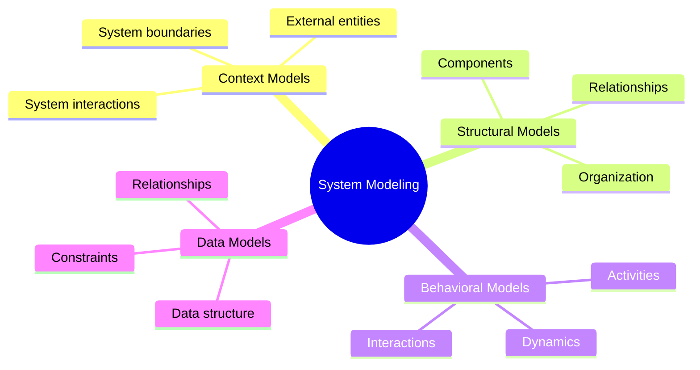
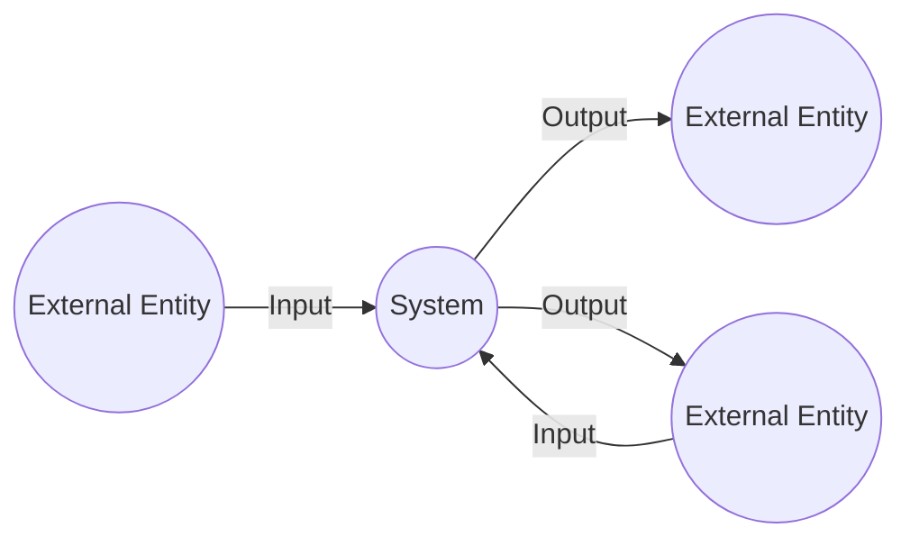
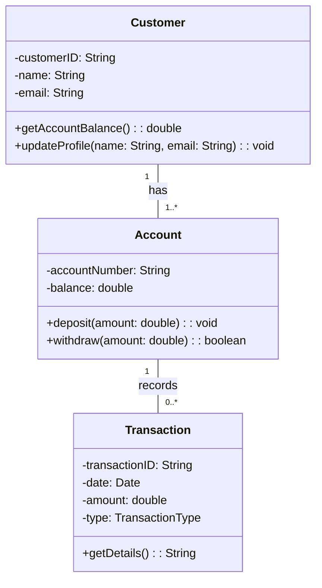
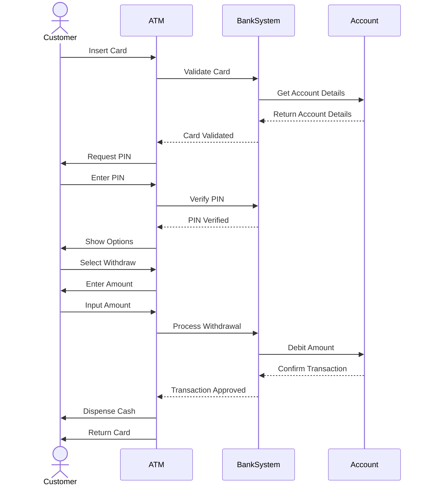
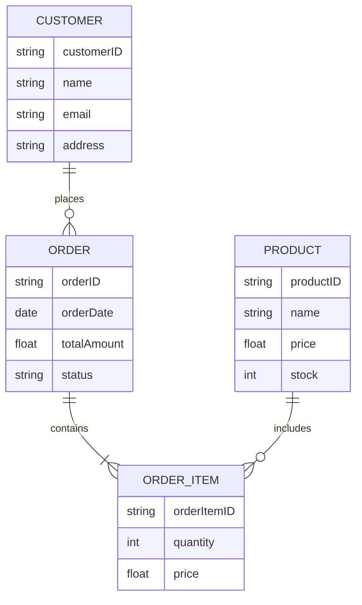

# System Modeling in Software Engineering

[Back to Course Content](README.md) | [Previous: Introduction](introduction.md) | [Next: Requirements Engineering →](requirements-engineering.md)

> Reference: This content is based on the System Modeling lectures (L1 and L2) from CSC 540 2.0 Software Engineering.

## What is System Modeling?

System modeling is the process of developing abstract models of a system, with each model presenting a different view or perspective of that system. It helps in understanding and visualizing complex systems before implementation.

## Importance of System Modeling

- **Communication**: Facilitates discussion among stakeholders
- **Analysis**: Helps in detecting inconsistencies, ambiguities, and incompleteness
- **Documentation**: Serves as a blueprint for system development
- **Visualization**: Enables visualizing complex systems and their interactions
- **Complexity Management**: Breaks down complex systems into manageable parts

## Types of System Models

### Context Models

Context models show the system's operational environment and its relationship with external entities.

**Real-world Application**: A context diagram for a banking system would show relationships with customers, regulators, partner banks, and other external systems.

### Structural Models

Structural models describe the organization of a system in terms of the components that make up the system and their relationships.

**Key structural models include**:

1. **Class Diagrams**: Represent system's static structure
2. **Component Diagrams**: Show system's physical components
3. **Package Diagrams**: Organize related elements into packages
4. **Deployment Diagrams**: Illustrate hardware configuration

#### Class Diagram Example

**Real-world Application**: In an e-commerce system, class diagrams help developers understand relationships between entities like users, products, orders, and payments.

### Behavioral Models

Behavioral models describe the dynamic behavior of the system and how it responds to events.

**Key behavioral models include**:

1. **Sequence Diagrams**: Show interactions between objects over time
2. **Activity Diagrams**: Depict workflow or process flow
3. **State Machine Diagrams**: Illustrate object states and transitions
4. **Use Case Diagrams**: Represent user interactions with the system

#### Sequence Diagram Example

**Real-world Application**: In an online ticket booking system, sequence diagrams help visualize the interaction between the user, booking system, payment gateway, and notification service.

### Data Models

Data models describe the structure of the data processed by the system, including relationships and constraints.

**Key data models include**:

1. **Entity-Relationship Diagrams (ERD)**: Show entities, attributes, and relationships
2. **Data Flow Diagrams (DFD)**: Represent flow of data through system processes

#### Entity-Relationship Diagram Example

**Real-world Application**: In a hospital management system, ERDs help design the database structure for patients, doctors, appointments, medical records, and billing.

## Unified Modeling Language (UML)

UML is a standardized modeling language used in software engineering to provide a way to visualize a system's architectural blueprints.

### UML Diagram Types

| Diagram Type | Purpose | Real-world Application |
|--------------|---------|------------------------|
| Class Diagram | Shows static structure of classes | Designing object-oriented systems |
| Object Diagram | Shows instances of classes | Visualizing complex object relationships |
| Component Diagram | Shows organization of physical components | Designing system architecture |
| Deployment Diagram | Shows hardware topology and software deployment | Planning system infrastructure |
| Use Case Diagram | Shows functionality from user perspective | Requirements gathering |
| Sequence Diagram | Shows object interactions over time | Designing system behavior |
| Activity Diagram | Shows workflows | Modeling business processes |
| State Machine Diagram | Shows object states and transitions | Modeling complex object lifecycles |
| Communication Diagram | Shows interactions between objects | Alternative to sequence diagrams |
| Timing Diagram | Shows timing constraints | Real-time systems design |

### UML Notation

#### Basic Elements

| Element | Symbol | Description |
|---------|--------|-------------|
| Class | Rectangle divided into compartments | Represents a class with attributes and operations |
| Interface | Circle with name below or stereotyped class | Represents a collection of operations with no implementation |
| Package | Folder icon | Groups related elements |
| Note | Rectangle with folded corner | Adds comments or constraints |
| Association | Line | Represents relationship between classes |
| Generalization | Line with hollow triangle | Represents inheritance |
| Dependency | Dashed line with arrow | Represents dependency between elements |
| Aggregation | Line with hollow diamond | Represents "has-a" relationship |
| Composition | Line with filled diamond | Represents stronger form of aggregation |
| Multiplicity | Numbers near association ends | Indicates number of instances in relationship |

## Model-Driven Engineering (MDE)

MDE is an approach where models, rather than code, are the primary artifacts in the development process.

### Principles of MDE

1. **Models as First-Class Artifacts**: Models are treated as primary artifacts
2. **Platform Independence**: Models are independent of implementation technology
3. **Automation**: Automatic transformation of models to code or other models
4. **Separation of Concerns**: Different aspects modeled separately

### Benefits of MDE

- **Productivity**: Increases development speed through automation
- **Quality**: Reduces errors through formal modeling
- **Maintainability**: Changes made at model level
- **Portability**: Platform-independent models
- **Consistency**: Ensures consistent implementation

### Challenges of MDE

- **Tool Maturity**: MDE tools may have limitations
- **Learning Curve**: Requires expertise in modeling languages
- **Integration**: Challenges in integrating with existing systems
- **Scalability**: May face issues with very large systems

## Practical Applications of System Modeling

### Financial Systems

- **Banking Software**: Modeling transactions, accounts, and security protocols
- **Trading Platforms**: Representing market interactions and order processing
- **Risk Management Systems**: Modeling risk analysis and mitigation strategies

### Healthcare Systems

- **Electronic Health Records**: Modeling patient data and access controls
- **Medical Imaging Systems**: Representing acquisition and processing workflows
- **Clinical Decision Support**: Modeling diagnostic processes and recommendations

### Enterprise Systems

- **ERP Systems**: Modeling business processes and data flows
- **CRM Systems**: Representing customer interactions and relationships
- **Supply Chain Management**: Modeling inventory, logistics, and procurement

### Transportation Systems

- **Air Traffic Control**: Modeling airspace, flights, and control processes
- **Railway Management**: Representing train schedules, routes, and signaling
- **Automotive Systems**: Modeling vehicle subsystems and interactions

## Modeling Best Practices

1. **Start Simple**: Begin with high-level models and refine
2. **Involve Stakeholders**: Ensure models address stakeholder needs
3. **Maintain Consistency**: Keep different models synchronized
4. **Prioritize Readability**: Create clear, understandable models
5. **Validate Models**: Verify models against requirements
6. **Iterate**: Refine models based on feedback and new insights
7. **Document Assumptions**: Record all assumptions made during modeling
8. **Focus on Value**: Model what's important, not everything
9. **Use Appropriate Notation**: Select suitable modeling techniques
10. **Consider Tool Support**: Use tools that support your modeling process

## Summary

System modeling plays a crucial role in software engineering by providing different perspectives of the system before implementation. It helps stakeholders understand, analyze, and visualize complex systems, leading to better design decisions and more successful implementations.

## Exercises

1. Draw a context diagram for a mobile banking application.
2. Create a class diagram for an online learning system with students, courses, instructors, and assignments.
3. Design a sequence diagram for the checkout process in an e-commerce application.
4. Develop an activity diagram for a patient registration process in a hospital.
5. Create a state machine diagram for a traffic light control system.

## Additional Resources

- Fowler, M. (2003). *UML Distilled: A Brief Guide to the Standard Object Modeling Language* (3rd Edition). Addison-Wesley.
- Rumbaugh, J., Jacobson, I., & Booch, G. (2004). *The Unified Modeling Language Reference Manual* (2nd Edition). Addison-Wesley.
- Object Management Group. (2017). *OMG Unified Modeling Language (OMG UML), Version 2.5.1*. https://www.omg.org/spec/UML/2.5.1/PDF 